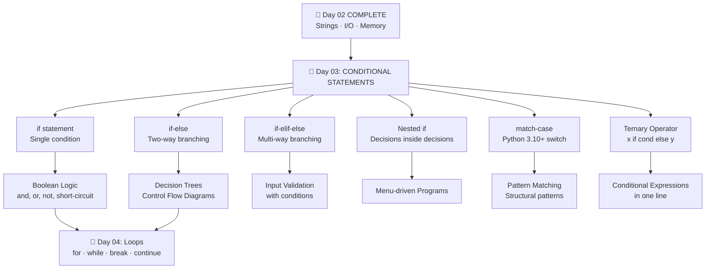

# 🐍 Python Programming — Day 02
### Advanced Input / Output · Strings · Memory Model · Code Quality

> **Author:** Python Mastery Series &nbsp;|&nbsp; **Level:** Beginner → Intermediate  
> **Prerequisites:** Day01 (Variables, Data Types, All Operators)  
> **Next:** Day03 — Conditional Statements  
> **GitHub Ready** ✅ &nbsp;|&nbsp; **Open Source Quality** ✅ &nbsp;|&nbsp; **Interview Ready** ✅

---

## 📌 Table of Contents

| # | Section | Topics |
|---|---------|--------|
| 1 | [Day01 Revision](#section-1--day01-revision) | Cheat Sheet, Mind Map, Formula Sheet |
| 2 | [Advanced Input Handling](#section-2--advanced-input-handling) | input() deep dive |
| 3 | [Advanced Input Formats](#section-3--advanced-input-formats) | split, map, list, competitive patterns |
| 4 | [Output Formatting](#section-4--output-formatting) | print(), sep, end, escape chars |
| 5 | [F-Strings Masterclass](#section-5--f-strings-masterclass) | All f-string features |
| 6 | [Strings Deep Dive](#section-6--strings-deep-dive) | Internals, Indexing, Slicing |
| 7 | [String Methods Masterclass](#section-7--string-methods-masterclass) | Every major method |
| 8 | [Python Memory Model](#section-8--python-memory-model) | Objects, References, GC |
| 9 | [Mutable vs Immutable](#section-9--mutable-vs-immutable) | Internal behavior |
| 10 | [Python Internally](#section-10--python-internally) | Bytecode, PVM, Execution |
| 11 | [Error Handling Basics](#section-11--error-handling-basics) | Syntax, Runtime, Logic errors |
| 12 | [Debugging Skills](#section-12--debugging-skills) | print debug, VS Code, PyCharm |
| 13 | [Code Quality](#section-13--code-quality) | PEP8, Clean Code, Docstrings |
| 14 | [Real World String Projects](#section-14--real-world-string-projects) | 10 complete projects |
| 15 | [High Value Project Ideas](#section-15--high-value-project-ideas) | 20 portfolio projects |
| 16 | [150 Practice Questions](#section-16--150-practice-questions) | Easy / Medium / Advanced |
| 17 | [75 Interview Questions](#section-17--75-interview-questions) | With answers |
| 18 | [Assignments](#section-18--assignments) | 4 assignments with solutions |
| 19 | [Day02 Revision](#section-19--day02-revision) | Quick notes, cheat sheet |
| 20 | [Next Step Roadmap](#section-20--next-step-roadmap) | Day03 preview |

---

## SECTION 1 — Day01 Revision

### 🗺️ One-Page Mind Map

```
                          PYTHON DAY 01
                               │
         ┌─────────────────────┼─────────────────────┐
         │                     │                     │
    VARIABLES            DATA TYPES              OPERATORS
         │                     │                     │
   name = "Ali"       ┌────────┴────────┐      ┌────┴────────────┐
   age  = 22          │                 │      │                 │
   pi   = 3.14      Numbers          Text   Arithmetic     Comparison
   flag = True     int/float/        str    + - * / //    == != > < >= <=
                   complex          bool    ** %
                                              │
                                    ┌─────────┼──────────┐
                                 Logical  Assignment  Bitwise
                                 and or   += -= *=    & | ^ ~ << >>
                                 not      /= //= %=
                                    │
                             Membership  Identity
                             in, not in  is, is not
```

---

### 📋 Day01 Operator Cheat Sheet

| Category | Operators | Example | Result |
|----------|-----------|---------|--------|
| **Arithmetic** | `+  -  *  /  //  %  **` | `7 // 2` | `3` |
| **Comparison** | `==  !=  >  <  >=  <=` | `5 != 3` | `True` |
| **Assignment** | `=  +=  -=  *=  /=  //=  %=  **=` | `x += 3` | `x = x+3` |
| **Logical** | `and  or  not` | `True and False` | `False` |
| **Bitwise** | `&  \|  ^  ~  <<  >>` | `5 & 3` | `1` |
| **Membership** | `in  not in` | `'a' in 'cat'` | `True` |
| **Identity** | `is  is not` | `x is None` | bool |

---

### 🔢 Formula Sheet

```python
# Integer Division
7 // 2   →  3          # Floor division

# Modulus
7 % 2    →  1          # Remainder

# Power
2 ** 10  →  1024

# Type Check
type(3.14)  →  <class 'float'>

# Type Conversion
int("42")   →  42
float("3.14")→ 3.14
str(100)    →  "100"
bool(0)     →  False
bool("")    →  False
bool("Hi")  →  True

# id() — Memory Address
id(x)       →  integer (memory location)
```

---

### ⚡ Quick Notes

> 🔵 **Python is dynamically typed** — you don't declare types  
> 🔵 **Everything in Python is an object** — even integers  
> 🔵 **`=` is assignment, `==` is comparison**  
> 🔵 **`is` checks identity (same object), `==` checks equality (same value)**  
> 🔵 **`None` is Python's null — use `is None` not `== None`**

---

## SECTION 2 — Advanced Input Handling

### 📖 Definition

`input()` is a built-in Python function that **pauses program execution**, displays an optional prompt, reads a line from standard input (keyboard), and **returns it as a string**.

---

### 🔬 How input() Works Internally

```
┌──────────────────────────────────────────────────────────┐
│                    EXECUTION FLOW                        │
│                                                          │
│  Your Code                                               │
│     │                                                    │
│     ▼                                                    │
│  input("Enter: ")                                        │
│     │                                                    │
│     ▼                                                    │
│  Python calls sys.stdin.readline()                       │
│     │                                                    │
│     ▼                                                    │
│  OS buffers keyboard input (Input Buffer)                │
│     │                                                    │
│     ▼                                                    │
│  User types "Baghel" and presses ENTER                   │
│     │                                                    │
│     ▼                                                    │
│  "\n" (newline) is stripped automatically                │
│     │                                                    │
│     ▼                                                    │
│  Returns "Baghel" as str object                          │
└──────────────────────────────────────────────────────────┘
```

---

### 🔍 Deep Dive: Why input() Always Returns String

```python
x = input("Enter a number: ")
print(type(x))   # <class 'str'>  ← ALWAYS str, even if you type 42
```

**Reason:** Python cannot know whether you intend the input to be a number, word, or symbol. The safest universal return type is `str`. It is your responsibility to convert.

> ⚠️ **WARNING:** Forgetting to convert input is one of the **most common beginner bugs** in Python.

---

### 🧠 Input Buffer Concept

The **input buffer** is a temporary memory area managed by the OS where your keystrokes are held until you press **Enter**. Python reads the entire buffer at once when `input()` is called.

```
Keyboard → [B][a][g][h][e][l][↵] → OS Buffer → Python reads → "Baghel"
```

Key facts:
- The `↵` (newline) is consumed but **not included** in the returned string
- All characters before newline are returned as-is
- Spaces are preserved inside the string

---

### 💡 Memory Trick

> **"input() is a POSTMAN — it delivers whatever you type, always in a STRING envelope."**

---

### ✅ Best Practices

```python
# ✅ Good — always provide a clear prompt
name = input("Enter your full name: ")

# ✅ Good — convert immediately
age = int(input("Enter your age: "))

# ❌ Bad — no prompt (confusing to user)
x = input()

# ❌ Bad — forget conversion
salary = input("Enter salary: ")
bonus = salary * 1.1   # TypeError!
```

---

## SECTION 3 — Advanced Input Formats

### 3.1 Single Input

```python
name = input("Enter name: ")
print(f"Hello, {name}!")
```

---

### 3.2 Multiple Inputs (Split on Same Line)

```python
# User types: Alice 25
name, age = input("Enter name and age: ").split()
print(name)   # Alice
print(age)    # 25  (still string!)
```

**How split() works here:**

```
"Alice 25" → .split() → ["Alice", "25"] → unpacked into name, age
```

---

### 3.3 Integer Inputs

```python
n = int(input("Enter a number: "))
print(n * 2)
```

---

### 3.4 Float Inputs

```python
price = float(input("Enter price: "))
tax = price * 0.18
print(f"Price with tax: {price + tax:.2f}")
```

---

### 3.5 Multiple Integer Inputs — `map()`

```python
# User types: 10 20 30
a, b, c = map(int, input("Enter 3 numbers: ").split())
print(a + b + c)   # 60
```

**How map() works:**

```
"10 20 30"
    │
 .split()
    │
["10", "20", "30"]
    │
map(int, ...)          ← applies int() to EACH element
    │
[10, 20, 30]           ← unpacked into a, b, c
```

---

### 3.6 List Input

```python
# User types: 5 3 8 1 9
numbers = list(map(int, input("Enter numbers: ").split()))
print(numbers)        # [5, 3, 8, 1, 9]
print(sum(numbers))   # 26
print(max(numbers))   # 9
```

---

### 3.7 Tuple Input

```python
# User types: 10 20
values = tuple(map(int, input("Enter values: ").split()))
print(values)   # (10, 20)
```

---

### 3.8 Competitive Programming Input Patterns

```python
# Pattern 1: Read n then n numbers
n = int(input())
arr = list(map(int, input().split()))

# Pattern 2: Multiple test cases
t = int(input())   # number of test cases
for _ in range(t):
    a, b = map(int, input().split())
    print(a + b)

# Pattern 3: Read until EOF (advanced)
import sys
data = sys.stdin.read().split()
# Now process data as a list

# Pattern 4: Fast input for large datasets
import sys
input = sys.stdin.readline   # Override input for speed

# Pattern 5: Read a grid/matrix
n, m = map(int, input().split())
grid = []
for _ in range(n):
    row = list(map(int, input().split()))
    grid.append(row)
```

> 💡 **Competitive Programming Tip:** `sys.stdin.readline` is **3–5x faster** than `input()` for large inputs. Always use it in contests.

---

### 3.9 Input Validation (Robust Input)

```python
# Safe integer input with error handling
def get_integer(prompt):
    while True:
        try:
            return int(input(prompt))
        except ValueError:
            print("❌ Invalid! Please enter a whole number.")

# Safe float input
def get_float(prompt):
    while True:
        try:
            return float(input(prompt))
        except ValueError:
            print("❌ Invalid! Please enter a decimal number.")

# Bounded input (e.g., age 1–120)
def get_age():
    while True:
        age = get_integer("Enter age (1-120): ")
        if 1 <= age <= 120:
            return age
        print("❌ Age must be between 1 and 120.")

age = get_age()
print(f"Your age: {age}")
```

---

### 3.10 Interview Questions — Input

| Question | Answer |
|----------|--------|
| Why does `input()` always return a string? | It reads raw text from stdin; type is ambiguous |
| How do you read 5 integers in one line? | `map(int, input().split())` |
| Difference between `input()` and `sys.stdin.readline()`? | `sys.stdin.readline()` is faster; keeps `\n` |
| How to read a 2D matrix from input? | Nested loops with `map(int, input().split())` |
| What happens if the user presses Enter without typing? | Returns empty string `""` |

---

## SECTION 4 — Output Formatting

### 📖 Definition

`print()` is Python's built-in output function. It writes data to **stdout** (console by default), converts objects to strings, adds a newline by default, and is highly configurable.

---

### 4.1 print() Signature

```python
print(*objects, sep=' ', end='\n', file=sys.stdout, flush=False)
```

| Parameter | Default | Purpose |
|-----------|---------|---------|
| `*objects` | — | Values to print (any number) |
| `sep` | `' '` (space) | Separator between values |
| `end` | `'\n'` | What to print at end |
| `file` | `sys.stdout` | Output destination |
| `flush` | `False` | Force flush buffer immediately |

---

### 4.2 sep — Custom Separator

```python
print("Alice", "Bob", "Charlie")              # Alice Bob Charlie
print("Alice", "Bob", "Charlie", sep=", ")    # Alice, Bob, Charlie
print("Alice", "Bob", "Charlie", sep=" | ")   # Alice | Bob | Charlie
print("2024", "01", "15",        sep="-")     # 2024-01-15
print("Alice", "Bob", "Charlie", sep="")      # AliceBobCharlie
```

---

### 4.3 end — Custom Line Ending

```python
print("Loading", end="")
print("...", end="")
print(" Done!")
# Output: Loading... Done!

# Print numbers on one line
for i in range(5):
    print(i, end=" ")
# Output: 0 1 2 3 4
```

---

### 4.4 Escape Characters

| Escape | Meaning | Example Output |
|--------|---------|----------------|
| `\n` | Newline | Line break |
| `\t` | Tab | Horizontal space |
| `\\` | Backslash | `\` |
| `\'` | Single quote | `'` |
| `\"` | Double quote | `"` |
| `\r` | Carriage return | Cursor to line start |
| `\b` | Backspace | Delete prev char |
| `\0` | Null character | Empty |

```python
print("Name:\tAlice\nAge:\t22")
# Name:   Alice
# Age:    22

print("Path: C:\\Users\\Baghel")
# Path: C:\Users\Baghel
```

---

### 4.5 Format Specifiers with format() and f-strings

```python
# Width and alignment
print(f"{'Name':<15} {'Score':>5}")   # Left align, right align
print(f"{'Alice':<15} {95:>5}")

# Number formatting
pi = 3.14159265
print(f"{pi:.2f}")          # 3.14        (2 decimal places)
print(f"{pi:.5f}")          # 3.14159     (5 decimal places)
print(f"{pi:10.3f}")        # _____3.142  (width 10, 3 decimals)

# Currency
price = 1234567.89
print(f"₹{price:,.2f}")     # ₹1,234,567.89  (thousands separator)

# Percentage
ratio = 0.8753
print(f"{ratio:.1%}")       # 87.5%

# Scientific Notation
big = 123456789
print(f"{big:e}")           # 1.234568e+08

# Zero padding
num = 42
print(f"{num:05d}")         # 00042

# Binary, Octal, Hex
n = 255
print(f"{n:b}")    # 11111111
print(f"{n:o}")    # 377
print(f"{n:x}")    # ff
print(f"{n:X}")    # FF
```

---

### 4.6 Table Formatting

```python
# Professional table output
print(f"{'Student':<15} {'Marks':>8} {'Grade':>8}")
print("-" * 35)
students = [("Alice", 95, "A"), ("Bob", 78, "B"), ("Charlie", 62, "C")]
for name, marks, grade in students:
    print(f"{name:<15} {marks:>8} {grade:>8}")
```

Output:
```
Student          Marks    Grade
-----------------------------------
Alice               95        A
Bob                 78        B
Charlie             62        C
```

---

## SECTION 5 — F-Strings Masterclass

### 📖 Definition

**f-strings** (formatted string literals, introduced in Python 3.6) allow you to embed Python expressions directly inside string literals using `{}`. They are the **fastest, most readable** string formatting method.

---

### 5.1 Basic Syntax

```python
name = "Baghel"
age  = 22
print(f"My name is {name} and I am {age} years old.")
# My name is Baghel and I am 22 years old.
```

---

### 5.2 Expressions Inside f-strings

```python
a, b = 10, 3
print(f"Sum: {a + b}")            # 13
print(f"Power: {a ** b}")         # 1000
print(f"Modulus: {a % b}")        # 1
print(f"Is even: {a % 2 == 0}")   # True
print(f"Uppercase: {'hello'.upper()}")  # HELLO
print(f"Length: {len('Python')}")  # 6
```

---

### 5.3 Format Specifiers

```python
# Syntax: f"{value:format_spec}"
# Format spec: [fill][align][sign][#][0][width][grouping][.precision][type]

pi = 3.14159
print(f"{pi:.2f}")        # 3.14
print(f"{pi:10.4f}")      # ____3.1416
print(f"{pi:>10.2f}")     # ______3.14  (right-align in 10 chars)
print(f"{pi:<10.2f}")     # 3.14______  (left-align)
print(f"{pi:^10.2f}")     # ___3.14___  (center-align)
print(f"{pi:*^10.2f}")    # ***3.14***  (center with * fill)
```

---

### 5.4 String Alignment & Padding

```python
word = "Python"
print(f"{word:>20}")    # right-aligned in 20 chars
print(f"{word:<20}")    # left-aligned
print(f"{word:^20}")    # centered
print(f"{word:*^20}")   # centered with * padding
print(f"{word:-<20}")   # left with - padding
```

---

### 5.5 Number Formatting

```python
n = 1234567
print(f"{n:,}")           # 1,234,567
print(f"{n:_}")           # 1_234_567
print(f"{n:+}")           # +1234567
print(f"{n:010}")         # 0001234567
print(f"{n:#x}")          # 0x12d687 (hex with prefix)
print(f"{n:#b}")          # 0b100101101011010000111 (binary)
```

---

### 5.6 Debug Expressions (Python 3.8+)

```python
x = 42
name = "Baghel"
print(f"{x = }")          # x = 42
print(f"{name = }")       # name = 'Baghel'
print(f"{x * 2 = }")      # x * 2 = 84
```

> 💡 The `=` inside `{}` is extremely useful for debugging — it prints both the expression and its value.

---

### 5.7 Multiline f-strings

```python
name  = "Baghel"
role  = "ML Engineer"
score = 98.5

report = (
    f"{'='*40}\n"
    f"  Name  : {name:<20}\n"
    f"  Role  : {role:<20}\n"
    f"  Score : {score:.1f}%\n"
    f"{'='*40}"
)
print(report)
```

---

### 5.8 Nested f-strings

```python
width  = 10
precision = 3
pi = 3.14159
print(f"{pi:{width}.{precision}f}")   # ______3.142
```

---

### 5.9 Real-World Examples

```python
# Invoice Generator
item  = "Laptop"
qty   = 2
price = 45999.99
total = qty * price
print(f"{'Item':<20} {'Qty':>5} {'Price':>12} {'Total':>14}")
print(f"{item:<20} {qty:>5} ₹{price:>11,.2f} ₹{total:>13,.2f}")

# Progress Bar
progress = 70
bar = "█" * (progress // 5) + "░" * (20 - progress // 5)
print(f"Progress: [{bar}] {progress}%")
```

---

## SECTION 6 — Strings Deep Dive

### 📖 Definition

A **string** in Python is an **immutable, ordered sequence of Unicode characters**. Internally it is a `str` object stored as an array of Unicode code points.

---

### 6.1 String Creation

```python
s1 = 'Hello'               # Single quotes
s2 = "World"               # Double quotes
s3 = '''Triple
single'''                  # Multiline
s4 = """Triple
double"""                  # Multiline
s5 = r"C:\new\tab"         # Raw string (escapes ignored)
s6 = b"bytes"              # Bytes literal (not str)
s7 = f"Value: {42}"        # f-string
```

---

### 6.2 String Memory Model & Interning

```
┌─────────────────────────────────────────────────────┐
│                 PYTHON HEAP MEMORY                  │
│                                                     │
│   s1 = "hello"          s2 = "hello"               │
│      │                     │                        │
│      └──────────┬──────────┘                        │
│                 ▼                                   │
│          ┌───────────┐                              │
│          │  "hello"  │  ← ONE object in memory     │
│          │ id: 12345 │    (String Interning)        │
│          └───────────┘                              │
│                                                     │
│   s1 is s2  →  True  (same object!)                 │
└─────────────────────────────────────────────────────┘
```

**String Interning:** Python automatically interns (reuses) string objects that look like identifiers (no spaces, no special chars). This saves memory.

```python
a = "hello"
b = "hello"
print(a is b)       # True  (interned)

x = "hello world"
y = "hello world"
print(x is y)       # False (may not intern — has space)
print(x == y)       # True  (values equal)
```

---

### 6.3 String Immutability

```python
s = "Python"
# s[0] = "J"   # ❌ TypeError: 'str' object does not support item assignment

# To "change" a string, create a NEW one:
s = "J" + s[1:]   # ✅ Creates new string "Jython"
```

---

### 6.4 Indexing

```python
s = "Python"
#    P  y  t  h  o  n
#    0  1  2  3  4  5   ← Positive index
#   -6 -5 -4 -3 -2 -1   ← Negative index

print(s[0])    # P
print(s[5])    # n
print(s[-1])   # n  (last char)
print(s[-6])   # P  (first char via negative)
```

---

### 6.5 Slicing

**Syntax:** `s[start : stop : step]`

| Parameter | Default | Meaning |
|-----------|---------|---------|
| `start` | `0` | Begin index (inclusive) |
| `stop` | `len(s)` | End index (exclusive) |
| `step` | `1` | Step between chars |

```python
s = "Python"
print(s[0:3])     # Pyt      (chars 0,1,2)
print(s[2:])      # thon     (from index 2 to end)
print(s[:4])      # Pyth     (from start to index 3)
print(s[::2])     # Pto      (every 2nd char)
print(s[::-1])    # nohtyP   (REVERSE the string!)
print(s[1:5:2])   # yh       (index 1,3)
print(s[:])       # Python   (full copy)
```

> 💡 **Memory Trick for reverse:** `s[::-1]` — "step backwards with -1"

---

### 6.6 String Traversal

```python
s = "Python"

# Method 1: for loop (most common)
for char in s:
    print(char, end=" ")   # P y t h o n

# Method 2: index-based
for i in range(len(s)):
    print(f"s[{i}] = {s[i]}")

# Method 3: enumerate (index + value)
for i, char in enumerate(s):
    print(f"Index {i}: {char}")
```

---

### 6.7 String Operations

```python
# Concatenation
s = "Hello" + " " + "World"   # Hello World

# Repetition
s = "Ha" * 3                  # HaHaHa

# Membership
print("Py" in "Python")       # True
print("py" in "Python")       # False (case-sensitive!)

# Length
print(len("Python"))          # 6

# Comparison (lexicographic / Unicode order)
print("apple" < "banana")     # True
print("Z" < "a")              # True  ('Z' = 90, 'a' = 97)
```

---

### 6.8 Unicode & ASCII

```python
# ASCII value of a character
print(ord('A'))   # 65
print(ord('a'))   # 97
print(ord('0'))   # 48

# Character from ASCII value
print(chr(65))    # A
print(chr(9829))  # ♥  (Unicode!)

# String encoding
s = "Hello"
encoded = s.encode('utf-8')    # b'Hello'
decoded = encoded.decode('utf-8')  # Hello

# Unicode example
s = "नमस्ते"   # Hindi — Python handles natively
print(len(s))   # 6 (counts Unicode code points)
```

---

## SECTION 7 — String Methods Masterclass

> Python strings have **40+ built-in methods**. We cover every important one.

---

### 7.1 Case Methods

```python
s = "hello WORLD python"

print(s.upper())        # HELLO WORLD PYTHON
print(s.lower())        # hello world python
print(s.title())        # Hello World Python
print(s.capitalize())   # Hello world python
print(s.swapcase())     # HELLO world PYTHON
print(s.casefold())     # hello world python  (aggressive lowercase, for comparisons)
```

| Method | Use Case |
|--------|----------|
| `upper()` | Shouting text, SQL keywords |
| `lower()` | Password/email comparison |
| `title()` | Names, headings |
| `capitalize()` | First word only |
| `swapcase()` | Toggle case |
| `casefold()` | Locale-aware lowercase (German ß → ss) |

---

### 7.2 Search Methods

```python
s = "Hello Python Python World"

# find() — returns index, -1 if not found
print(s.find("Python"))       # 6
print(s.find("Python", 7))    # 13  (search from index 7)
print(s.find("Java"))         # -1

# index() — like find but raises ValueError if not found
print(s.index("Python"))      # 6
# s.index("Java")             # ValueError!

# count() — occurrences
print(s.count("Python"))      # 2

# startswith() / endswith()
print(s.startswith("Hello"))  # True
print(s.endswith("World"))    # True
print(s.startswith("Py", 6))  # True  (check from index 6)
```

> ⚠️ **Use `find()` when absence is possible; use `index()` only when you're sure the substring exists.**

---

### 7.3 Replace & Transform

```python
s = "Hello World Hello"

# replace(old, new, count=-1)
print(s.replace("Hello", "Hi"))        # Hi World Hi
print(s.replace("Hello", "Hi", 1))     # Hi World Hello  (replace once)

# translate() — character-level replacement
table = str.maketrans("aeiou", "12345")
print("hello world".translate(table))  # h2ll4 w4rld

# Remove characters using translate
table = str.maketrans("", "", "aeiou")   # Remove vowels
print("hello world".translate(table))   # hll wrld
```

---

### 7.4 Split & Join

```python
# split(sep=None, maxsplit=-1)
s = "apple,banana,cherry,date"
print(s.split(","))            # ['apple', 'banana', 'cherry', 'date']
print(s.split(",", 2))         # ['apple', 'banana', 'cherry,date']
print("hello world".split())  # ['hello', 'world']  (whitespace default)

# rsplit() — splits from the right
print(s.rsplit(",", 1))        # ['apple,banana,cherry', 'date']

# splitlines()
text = "Line 1\nLine 2\nLine 3"
print(text.splitlines())       # ['Line 1', 'Line 2', 'Line 3']

# join() — opposite of split
words = ["Python", "is", "awesome"]
print(" ".join(words))         # Python is awesome
print("-".join(words))         # Python-is-awesome
print("".join(words))          # Pythonisawesome

# Common pattern: clean and rejoin
sentence = "  too   many   spaces  "
clean = " ".join(sentence.split())
print(clean)    # too many spaces
```

---

### 7.5 Strip Methods

```python
s = "   \t Hello World \n   "

print(s.strip())     # "Hello World"    (both sides)
print(s.lstrip())    # "Hello World \n   " (left only)
print(s.rstrip())    # "   \t Hello World"  (right only)

# Strip specific characters
s = "###Python###"
print(s.strip("#"))   # Python
print(s.lstrip("#"))  # Python###
print(s.rstrip("#"))  # ###Python
```

---

### 7.6 Alignment Methods

```python
s = "Python"

print(s.center(20))         # "       Python       "
print(s.center(20, "="))    # "=======Python======="
print(s.ljust(20))          # "Python              "
print(s.ljust(20, "."))     # "Python.............."
print(s.rjust(20))          # "              Python"
print(s.rjust(20, "0"))     # "00000000000000Python"

# zfill — zero-fill for numbers
print("42".zfill(6))        # 000042
print("-42".zfill(6))       # -00042  (preserves sign!)
```

---

### 7.7 Partition Methods

```python
s = "user@example.com"

# partition(sep) — splits into 3-tuple: before, sep, after
print(s.partition("@"))    # ('user', '@', 'example.com')

# rpartition — from right
path = "home/user/documents/file.txt"
print(path.rpartition("/"))  # ('home/user/documents', '/', 'file.txt')
```

---

### 7.8 Check Methods (Return Boolean)

```python
print("hello".isalpha())      # True  (all alphabets)
print("hello123".isalpha())   # False
print("12345".isdigit())      # True  (all digits)
print("hello world".isalnum())# False (space!)
print("hello123".isalnum())   # True
print("   ".isspace())        # True
print("Hello World".istitle())# True
print("HELLO".isupper())      # True
print("hello".islower())      # True
print("123".isnumeric())      # True
print("½".isnumeric())        # True  (½ is numeric Unicode)
print("123".isdecimal())      # True
print("½".isdecimal())        # False (only 0-9)
```

---

### 7.9 Other Useful Methods

```python
# expandtabs — replace \t with spaces
s = "Name\tAge\tCity"
print(s.expandtabs(10))    # Name      Age       City

# encode / decode
s = "Hello नमस्ते"
b = s.encode("utf-8")
print(b)                    # b'Hello \xe0\xa4\xa8\xe0\xa4\xae...'
print(b.decode("utf-8"))    # Hello नमस्ते

# format()
template = "Hello {name}, you are {age} years old."
print(template.format(name="Alice", age=25))

# format with positional
print("{0} + {1} = {2}".format(2, 3, 5))
```

---

## SECTION 8 — Python Memory Model

### 📖 Objects, References, Variables

In Python:
- **Everything is an object** (int, str, list, function — all objects)
- A **variable** is a **reference** (pointer) to an object
- Variables don't "contain" values — they **point to** objects

```
┌─────────────────────────────────────────────────┐
│                  MEMORY MODEL                   │
│                                                 │
│   Code:  x = 42                                 │
│                                                 │
│   Stack (Names)         Heap (Objects)          │
│   ┌────────────┐        ┌──────────────┐        │
│   │  x  ──────┼───────▶│  int: 42     │        │
│   └────────────┘        │  id: 140...  │        │
│                         └──────────────┘        │
│                                                 │
│   Code: y = x   (y points to SAME object)       │
│   ┌────────────┐        ┌──────────────┐        │
│   │  x  ──────┼───────▶│  int: 42     │◀──┐    │
│   │  y  ──────┼─────────────────────────┘  │    │
│   └────────────┘        └──────────────┘    │    │
└─────────────────────────────────────────────────┘
```

---

### 8.1 id() and type()

```python
x = 42
print(id(x))      # e.g. 9788576  (memory address of the int 42 object)
print(type(x))    # <class 'int'>

y = x
print(id(y) == id(x))   # True — same object!

x = 100
print(id(x) == id(y))   # False — x now points to a NEW object
```

---

### 8.2 Small Integer Caching

Python **pre-creates** int objects for -5 to 256 and reuses them:

```python
a = 100
b = 100
print(a is b)    # True  (cached)

a = 1000
b = 1000
print(a is b)    # False (not cached — new objects created)
print(a == b)    # True  (values are equal)
```

> ⚠️ **Never use `is` to compare integers in general code.** Use `==`. The caching is an implementation detail.

---

### 8.3 Reference Counting & Garbage Collection

Python uses **Reference Counting** as its primary memory management strategy:

```python
import sys

x = [1, 2, 3]
print(sys.getrefcount(x))   # 2 (x + getrefcount's own temp ref)

y = x
print(sys.getrefcount(x))   # 3

del y
print(sys.getrefcount(x))   # 2 again

# When refcount hits 0, object is garbage collected
```

**Cyclic Garbage Collector:** Python also has a cyclic GC for circular references:

```python
# Circular reference (neither can be freed by refcount alone)
a = {}
b = {}
a['ref'] = b
b['ref'] = a
# Python's cyclic GC handles this
```

---

## SECTION 9 — Mutable vs Immutable

### 📖 The Core Distinction

| | **Immutable** | **Mutable** |
|-|---------------|-------------|
| **Can change after creation?** | ❌ No | ✅ Yes |
| **Types** | int, float, str, tuple, bool, frozenset | list, dict, set |
| **Same object when equal?** | Sometimes (interning) | No |
| **Safe as dict key?** | ✅ Yes | ❌ No |
| **Thread safe?** | ✅ Yes | ⚠️ Needs care |

---

### 9.1 Immutable Behavior

```python
x = 42
print(id(x))   # 9788576

x = x + 1     # Does NOT modify 42 — creates NEW int 43
print(id(x))   # DIFFERENT id!

# ━━━ String immutability ━━━
s = "hello"
# s[0] = "H"   # ❌ TypeError

# "Modifying" creates new string:
s2 = s.upper()   # NEW object
print(s)         # hello  (original unchanged)
print(s2)        # HELLO  (new object)
```

---

### 9.2 Mutable Behavior

```python
a = [1, 2, 3]
b = a            # b points to SAME list!
b.append(4)
print(a)         # [1, 2, 3, 4]  ← a was changed!

# To get an independent copy:
c = a.copy()     # or: c = a[:]  or: c = list(a)
c.append(99)
print(a)         # [1, 2, 3, 4]  ← a unchanged
print(c)         # [1, 2, 3, 4, 99]
```

**Memory Diagram:**
```
a = [1,2,3]      b = a
                  
Stack:    Heap:
a ──────▶ [1, 2, 3]
b ──────────▲
```

---

### 9.3 Why Immutability Matters

```python
# ✅ Immutables are safe as dict keys
d = {}
d[(1, 2)] = "point"     # tuple key — OK
# d[[1,2]] = "point"    # ❌ TypeError — list unhashable

# ✅ Immutables safe to share across threads
# ✅ Immutables can be interned for memory savings
# ✅ f(x) can't accidentally change your string/int
```

---

## SECTION 10 — Python Internally

### How Python Executes Your Code

```
┌────────────────────────────────────────────────────────┐
│                  PYTHON EXECUTION PIPELINE             │
│                                                        │
│  1. SOURCE CODE (.py)                                  │
│        hello.py                                        │
│        print("Hello, World!")                          │
│                 │                                      │
│                 ▼                                      │
│  2. LEXER (Tokenization)                               │
│        NAME:'print' OP:'(' STR:'Hello' OP:')' NEWLINE  │
│                 │                                      │
│                 ▼                                      │
│  3. PARSER (AST — Abstract Syntax Tree)               │
│        Module                                          │
│          └─ Expr                                       │
│               └─ Call: print("Hello, World!")         │
│                 │                                      │
│                 ▼                                      │
│  4. COMPILER (Bytecode Generation)                     │
│        LOAD_GLOBAL  'print'                            │
│        LOAD_CONST   'Hello, World!'                    │
│        CALL_FUNCTION 1                                 │
│                 │                                      │
│                 ▼                                      │
│  5. .pyc FILE (Bytecode Cache)                         │
│        __pycache__/hello.cpython-311.pyc               │
│                 │                                      │
│                 ▼                                      │
│  6. PVM — Python Virtual Machine                       │
│        Executes bytecode instruction by instruction    │
│                 │                                      │
│                 ▼                                      │
│  7. OUTPUT                                             │
│        Hello, World!                                   │
└────────────────────────────────────────────────────────┘
```

---

### 10.1 Bytecode Inspection

```python
import dis

def greet(name):
    return f"Hello, {name}!"

dis.dis(greet)
# Output shows bytecode instructions:
# LOAD_CONST, LOAD_FAST, FORMAT_VALUE, BUILD_STRING, RETURN_VALUE
```

---

### 10.2 .pyc Files

- Stored in `__pycache__/` directory
- Named: `module.cpython-311.pyc`
- Python checks if source is newer; if not, uses cached bytecode
- Speeds up loading on repeated runs

---

### 10.3 CPython vs Other Implementations

| Implementation | Language | Special Feature |
|----------------|----------|-----------------|
| **CPython** | C | Default, reference implementation |
| **PyPy** | Python/RPython | JIT compilation (2–10x faster) |
| **Jython** | Java | Runs on JVM |
| **IronPython** | C# | Runs on .NET |
| **MicroPython** | C | For microcontrollers |

---

## SECTION 11 — Error Handling Basics

### 11.1 Types of Errors

#### Syntax Error — Code is grammatically wrong
```python
# ❌ SyntaxError
print("Hello"     # Missing closing parenthesis
if x = 5:         # = instead of ==
def greet         # Missing () and :
```

Python catches these **before** running — they show up immediately.

#### Runtime Error — Code is correct but fails during execution
```python
# ❌ ZeroDivisionError
x = 10 / 0

# ❌ TypeError
result = "5" + 5

# ❌ ValueError
n = int("hello")

# ❌ IndexError
lst = [1, 2, 3]
print(lst[10])

# ❌ NameError
print(undefined_variable)
```

#### Logical Error — Code runs but gives wrong result
```python
# ❌ Bug: wrong formula for area of circle
import math
radius = 5
area = 2 * math.pi * radius     # Wrong! Should be pi * r**2
print(area)   # 31.41... instead of 78.54...
```

> ⚠️ **Logical errors are the hardest to find** — Python doesn't warn you. You must verify with test cases.

---

### 11.2 Reading Tracebacks

```
Traceback (most recent call last):
  File "script.py", line 5, in <module>   ← File & line number
    result = int("abc")                   ← The line of code
ValueError: invalid literal for int()     ← Error type: message
with base 10: 'abc'
```

**How to read:**
1. Go to the **bottom** — that's the actual error type and message
2. Look at the **line number** above it
3. Read from **bottom to top** to trace the call stack

---

### 11.3 Common Errors Quick Reference

| Error | Cause | Fix |
|-------|-------|-----|
| `SyntaxError` | Wrong grammar | Check parentheses, colons, quotes |
| `NameError` | Undefined variable | Check spelling, scope |
| `TypeError` | Wrong type | Check types with `type()` |
| `ValueError` | Right type, wrong value | Validate before converting |
| `IndexError` | Index out of range | Check `len()` before indexing |
| `KeyError` | Missing dict key | Use `.get()` |
| `ZeroDivisionError` | Divide by zero | Check divisor != 0 |
| `AttributeError` | Method doesn't exist | Check spelling, type |
| `ImportError` | Module not found | `pip install` it |
| `IndentationError` | Wrong indentation | 4 spaces consistently |

---

## SECTION 12 — Debugging Skills

### 12.1 Print Debugging

```python
# Add print statements to inspect values
def calculate_average(numbers):
    print(f"DEBUG: numbers = {numbers}")       # Inspect input
    total = sum(numbers)
    print(f"DEBUG: total = {total}")           # Inspect intermediate
    count = len(numbers)
    print(f"DEBUG: count = {count}")
    avg = total / count
    print(f"DEBUG: avg = {avg}")               # Inspect output
    return avg
```

---

### 12.2 Type Debugging

```python
def process(data):
    print(f"TYPE CHECK: data is {type(data)}, value = {data!r}")
    # !r uses repr() — shows quotes for strings, helpful for debugging
```

---

### 12.3 id() Debugging

```python
# Trace object identity to detect aliasing bugs
a = [1, 2, 3]
b = a
print(f"id(a) = {id(a)}, id(b) = {id(b)}")
print(f"Same object: {a is b}")
b = a.copy()
print(f"After copy — Same object: {a is b}")
```

---

### 12.4 VS Code Debugging

1. Open your `.py` file
2. Click the **gutter** (left of line number) to set a **breakpoint** (red dot)
3. Press `F5` → Select "Python File"
4. Use controls:
   - `F10` — Step Over (next line)
   - `F11` — Step Into (enter function)
   - `F5` — Continue to next breakpoint
5. Inspect variables in the **Variables** panel on the left

---

### 12.5 assert Statement (Quick Sanity Check)

```python
def divide(a, b):
    assert b != 0, "Denominator cannot be zero!"
    return a / b

divide(10, 0)   # AssertionError: Denominator cannot be zero!
```

---

## SECTION 13 — Code Quality

### 13.1 PEP 8 — Python Style Guide

PEP 8 is Python's official style guide. Professional Python code follows it universally.

```python
# ━━━ NAMING CONVENTIONS ━━━
variable_name    = 42        # snake_case for variables
function_name    = ...       # snake_case for functions
CLASS_NAME       = ...       # PascalCase for classes
CONSTANT_VALUE   = 3.14      # UPPER_SNAKE_CASE for constants
_private_var     = ...       # _prefix for private
__dunder__       = ...       # __prefix__ for special methods

# ━━━ SPACING ━━━
x = 5                        # Spaces around = in assignment
print(x + 1)                 # Spaces around operators
def func(a, b, c):           # Space after comma
    pass

# ━━━ NO SPACES ━━━
func(arg=value)              # No spaces around = in keyword args
lst[0]                       # No spaces inside brackets
d['key']                     # No spaces inside brackets

# ━━━ BLANK LINES ━━━
# 2 blank lines between top-level functions/classes
# 1 blank line between methods inside a class
```

---

### 13.2 Comments

```python
# ━━━ INLINE COMMENT ━━━
x = x + 1   # Increment counter

# ━━━ BLOCK COMMENT ━━━
# Calculate the compound interest formula
# A = P(1 + r/n)^(nt)
# where P=principal, r=rate, n=compoundings/year, t=years

# ━━━ WHAT NOT TO DO ━━━
x = x + 1   # ❌ Bad: "add 1 to x" — obvious, useless
# ✅ Good comments explain WHY, not WHAT
```

---

### 13.3 Docstrings

```python
def calculate_bmi(weight_kg, height_m):
    """
    Calculate Body Mass Index (BMI).

    Args:
        weight_kg (float): Weight in kilograms.
        height_m  (float): Height in metres.

    Returns:
        float: BMI value rounded to 2 decimal places.

    Example:
        >>> calculate_bmi(70, 1.75)
        22.86
    """
    return round(weight_kg / height_m ** 2, 2)

# Access docstring
help(calculate_bmi)
print(calculate_bmi.__doc__)
```

---

### 13.4 Clean Code Principles

```python
# ━━━ 1. Meaningful Names ━━━
# ❌ Bad
def calc(x, y):
    return x * y * 0.18

# ✅ Good
def calculate_gst(price, quantity):
    GST_RATE = 0.18
    return price * quantity * GST_RATE

# ━━━ 2. Don't Repeat Yourself (DRY) ━━━
# ❌ Bad — repeated code
print("="*50)
print("Section 1")
print("="*50)
print("="*50)
print("Section 2")
print("="*50)

# ✅ Good — function
def print_header(title):
    print("=" * 50)
    print(title)
    print("=" * 50)

print_header("Section 1")
print_header("Section 2")

# ━━━ 3. One Function, One Purpose ━━━
# Functions should do ONE thing and do it well
```

---

## SECTION 14 — Real World String Projects

### Project 1: Name Formatter

```python
"""
Name Formatter — Standardizes name input
"""

def format_name(raw_name):
    """Format raw name input into Title Case, strip extra spaces."""
    parts = raw_name.strip().split()
    return " ".join(word.capitalize() for word in parts)

# Test
names = ["  alice smith  ", "BOB JONES", "charlie   BROWN"]
for name in names:
    print(f"Input: {name!r:30} → Output: {format_name(name)}")
```

---

### Project 2: Username Generator

```python
"""
Username Generator — Creates valid username from full name
"""

def generate_username(full_name, birth_year):
    """Generate username: firstname_lastname_last2digits_of_year."""
    parts = full_name.lower().strip().split()
    first = parts[0] if parts else "user"
    last  = parts[-1] if len(parts) > 1 else "x"
    year_suffix = str(birth_year)[-2:]
    # Remove non-alphanumeric chars
    username = f"{first}_{last}_{year_suffix}"
    username = "".join(c for c in username if c.isalnum() or c == "_")
    return username

print(generate_username("Baghel Kumar", 2003))   # baghel_kumar_03
print(generate_username("Alice O'Brien", 1999))   # alice_obrien_99
```

---

### Project 3: Basic Email Validator

```python
"""
Email Validator — Basic structural validation
"""

def is_valid_email(email):
    """Check if email has valid basic structure."""
    email = email.strip()
    
    # Must contain exactly one @
    if email.count("@") != 1:
        return False, "Must contain exactly one @"
    
    local, domain = email.split("@")
    
    # Local part must not be empty
    if not local:
        return False, "Username part is empty"
    
    # Domain must contain at least one dot
    if "." not in domain:
        return False, "Domain must contain a dot"
    
    # Domain parts must not be empty
    domain_parts = domain.split(".")
    if any(part == "" for part in domain_parts):
        return False, "Invalid domain structure"
    
    # Must end with 2-6 char extension
    extension = domain_parts[-1]
    if not (2 <= len(extension) <= 6):
        return False, "Invalid extension length"
    
    return True, "Valid email!"

# Test
test_emails = [
    "baghel@gmail.com", "invalid@@gmail.com",
    "no_at_sign.com", "missing@dot", "user@.com"
]
for email in test_emails:
    valid, msg = is_valid_email(email)
    status = "✅" if valid else "❌"
    print(f"{status} {email:<30} — {msg}")
```

---

### Project 4: Password Strength Analyzer

```python
"""
Password Strength Analyzer
"""

def analyze_password(password):
    """Analyze password and return strength score + feedback."""
    score    = 0
    feedback = []
    
    # Length check
    if len(password) >= 8:
        score += 1
    else:
        feedback.append("❌ Use at least 8 characters")
    
    if len(password) >= 12:
        score += 1
    
    # Character type checks
    if any(c.isupper() for c in password):
        score += 1
    else:
        feedback.append("❌ Add uppercase letters (A-Z)")
    
    if any(c.islower() for c in password):
        score += 1
    else:
        feedback.append("❌ Add lowercase letters (a-z)")
    
    if any(c.isdigit() for c in password):
        score += 1
    else:
        feedback.append("❌ Add digits (0-9)")
    
    special = "!@#$%^&*()_+-=[]{}|;:,.<>?"
    if any(c in special for c in password):
        score += 1
    else:
        feedback.append("❌ Add special characters (!@#...)")
    
    # Strength label
    if score <= 2:
        strength = "🔴 WEAK"
    elif score <= 4:
        strength = "🟡 MODERATE"
    elif score <= 5:
        strength = "🟢 STRONG"
    else:
        strength = "💎 VERY STRONG"
    
    return strength, score, feedback

# Test
passwords = ["abc", "Password1", "S3cur3P@ss!", "MyV3ryStr0ng#Pass!"]
for pwd in passwords:
    strength, score, fb = analyze_password(pwd)
    print(f"\nPassword: {pwd}")
    print(f"Strength: {strength} (Score: {score}/6)")
    for tip in fb:
        print(f"  {tip}")
```

---

### Project 5: Text Statistics Analyzer

```python
"""
Text Statistics Analyzer
"""

def analyze_text(text):
    """Return comprehensive statistics about the given text."""
    words      = text.split()
    sentences  = text.replace("!", ".").replace("?", ".").split(".")
    sentences  = [s.strip() for s in sentences if s.strip()]
    chars_all  = len(text)
    chars_no_space = len(text.replace(" ", ""))
    
    # Word frequency
    word_freq = {}
    for word in words:
        clean = word.lower().strip(".,!?;:")
        word_freq[clean] = word_freq.get(clean, 0) + 1
    
    # Most common words
    sorted_freq = sorted(word_freq.items(), key=lambda x: x[1], reverse=True)
    
    print("=" * 45)
    print("       TEXT STATISTICS REPORT")
    print("=" * 45)
    print(f"{'Characters (total)':<30}: {chars_all}")
    print(f"{'Characters (no spaces)':<30}: {chars_no_space}")
    print(f"{'Words':<30}: {len(words)}")
    print(f"{'Sentences':<30}: {len(sentences)}")
    print(f"{'Unique words':<30}: {len(word_freq)}")
    
    if words:
        avg_word_len = sum(len(w) for w in words) / len(words)
        print(f"{'Avg word length':<30}: {avg_word_len:.1f}")
    
    print(f"\nTop 5 Words:")
    for word, count in sorted_freq[:5]:
        bar = "█" * count
        print(f"  {word:<20} {bar} ({count})")

text = """Python is a powerful programming language.
Python is easy to learn and Python is widely used in data science."""
analyze_text(text)
```

---

### Project 6: Word Counter

```python
def word_counter(text):
    words = text.split()
    print(f"Total words   : {len(words)}")
    print(f"Total chars   : {len(text)}")
    print(f"Total lines   : {text.count(chr(10)) + 1}")
    print(f"Unique words  : {len(set(w.lower() for w in words))}")
```

---

### Project 7: Character Frequency Analyzer

```python
def char_frequency(text, top_n=10):
    freq = {}
    for char in text.lower():
        if char.isalpha():
            freq[char] = freq.get(char, 0) + 1
    sorted_freq = sorted(freq.items(), key=lambda x: x[1], reverse=True)
    print(f"Top {top_n} Characters:")
    for char, count in sorted_freq[:top_n]:
        bar = "█" * (count // max(1, max(c for _, c in sorted_freq[:top_n]) // 20))
        print(f"  '{char}' : {bar} {count}")
```

---

### Project 8: String Encryption Toy (Caesar Cipher)

```python
"""
Caesar Cipher — Simple shift encryption
"""

def caesar_encrypt(text, shift):
    result = ""
    for char in text:
        if char.isalpha():
            base  = ord('A') if char.isupper() else ord('a')
            result += chr((ord(char) - base + shift) % 26 + base)
        else:
            result += char
    return result

def caesar_decrypt(text, shift):
    return caesar_encrypt(text, -shift)

msg       = "Hello Baghel"
encrypted = caesar_encrypt(msg, 3)
decrypted = caesar_decrypt(encrypted, 3)
print(f"Original : {msg}")
print(f"Encrypted: {encrypted}")   # Khoor Edjkho
print(f"Decrypted: {decrypted}")   # Hello Baghel
```

---

### Project 9: Resume Keyword Analyzer

```python
"""
Resume Keyword Analyzer — Check if resume has required keywords
"""

def analyze_resume(resume_text, job_keywords):
    resume_lower = resume_text.lower()
    found    = [kw for kw in job_keywords if kw.lower() in resume_lower]
    missing  = [kw for kw in job_keywords if kw.lower() not in resume_lower]
    score    = len(found) / len(job_keywords) * 100

    print(f"Match Score : {score:.1f}%")
    print(f"✅ Found    : {', '.join(found)}")
    print(f"❌ Missing  : {', '.join(missing)}")
    return score

resume = "Experienced Python developer skilled in machine learning, NLP, TensorFlow, and data analysis."
keywords = ["Python", "Machine Learning", "NLP", "TensorFlow", "Docker", "Kubernetes"]
analyze_resume(resume, keywords)
```

---

### Project 10: Text Cleaner

```python
"""
Text Cleaner — Normalize messy text
"""

def clean_text(text):
    """Remove extra whitespace, fix punctuation spacing, normalize case."""
    # Remove extra whitespace
    text = " ".join(text.split())
    # Remove spaces before punctuation
    for punct in [",", ".", "!", "?", ":", ";"]:
        text = text.replace(f" {punct}", punct)
    # Capitalize sentences
    sentences = text.split(". ")
    text = ". ".join(s.capitalize() for s in sentences)
    return text

messy = "  hello   ,  world   .  this  is  python   .  "
print(clean_text(messy))   # Hello, world. This is python.
```

---

## SECTION 15 — High Value Project Ideas

| # | Project | Difficulty | Skills Learned | Real World Value |
|---|---------|-----------|----------------|-----------------|
| 1 | Smart Input Validation System | ⭐ | input(), type checking, loops | Form validation logic |
| 2 | CLI User Registration System | ⭐⭐ | string ops, dicts, validation | Auth systems |
| 3 | Password Manager (Basic) | ⭐⭐ | Caesar/XOR cipher, file ops | Security tools |
| 4 | Text Analyzer Dashboard | ⭐⭐ | string methods, frequency analysis | NLP preprocessing |
| 5 | Log File Parser | ⭐⭐ | split, find, regex basics | DevOps, SRE |
| 6 | CSV Text Cleaner | ⭐⭐ | string strip, replace, join | Data Science ETL |
| 7 | Student Record Formatter | ⭐ | f-strings, alignment | School management apps |
| 8 | Contact Book CLI | ⭐⭐ | dicts, string search | Personal productivity |
| 9 | Text Search Engine | ⭐⭐⭐ | index, find, slicing, ranking | Information retrieval |
| 10 | Chat Log Analyzer | ⭐⭐ | split, count, timestamp parsing | Analytics |
| 11 | AI Prompt Formatter | ⭐⭐⭐ | templates, f-strings, token count | LLM Engineering |
| 12 | Resume Keyword Scorer | ⭐⭐ | string search, scoring | HR Tech, ATS systems |
| 13 | Dataset Text Cleaner | ⭐⭐⭐ | regex prep, normalize, encode | ML data pipelines |
| 14 | OCR Text Post-Processor | ⭐⭐⭐ | replace, translate, fuzzy match | Document processing |
| 15 | Markdown → Plain Text Converter | ⭐⭐ | replace, regex, strip | Documentation tools |
| 16 | Terminal Productivity Tool | ⭐⭐⭐ | CLI, string parsing, os module | Developer tools |
| 17 | Command Line Notes App | ⭐⭐ | file I/O, search, tagging | Personal knowledge base |
| 18 | Coding Interview Helper | ⭐⭐⭐ | string algorithms, output format | Tech interview prep |
| 19 | Data Preprocessing Pipeline | ⭐⭐⭐ | normalize, encode, tokenize | ML preprocessing |
| 20 | LLM Prompt Engineering Toolkit | ⭐⭐⭐⭐ | templates, token counting, chains | GPT/Claude API usage |

**Future improvements for each project:** Add file I/O, GUI (tkinter), REST API, database (SQLite), and eventually ML models.

---

## SECTION 16 — 150 Practice Questions

### 🟢 Easy (50 Questions)

**Input / Output**
1. Write a program to take your name as input and print "Hello, [name]!"
2. Take two integers as input and print their sum.
3. Take three numbers on one line (space-separated) and print their average.
4. Print the multiplication table of a number entered by the user.
5. Take a name and age; print: "Name: [name], Age: [age]"

**String Basics**
6. Print the first character of a string.
7. Print the last character of a string.
8. Print the length of a string.
9. Reverse a string using slicing.
10. Convert a string to uppercase.
11. Convert a string to lowercase.
12. Check if a string starts with "Python".
13. Check if a string ends with ".com".
14. Count how many times "a" appears in "banana".
15. Replace "cat" with "dog" in "I have a cat".

**F-strings**
16. Use an f-string to print your name and NIELIT branch.
17. Format a float to 2 decimal places using an f-string.
18. Print a number right-aligned in a field of width 10.
19. Print a string centered with `*` padding using f-string.
20. Use f-string debug mode (`=`) to print a variable's name and value.

**Slicing**
21. Extract "Python" from "Hello Python World".
22. Get every second character of "abcdefgh".
23. Get the last 3 characters of a string.
24. Reverse "algorithm" using slicing.
25. Get characters from index 2 to 7 (exclusive).

**String Methods**
26. Strip whitespace from `"   hello   "`.
27. Split "a,b,c,d" by comma.
28. Join ["one", "two", "three"] with " - ".
29. Capitalize the first letter of "hello world".
30. Convert "Hello World" to title case.
31. Check if "12345" is all digits.
32. Check if "hello" is all alphabets.
33. Find the index of "world" in "hello world".
34. Replace all spaces in "hello world" with underscores.
35. Repeat "ab" five times.

**Memory / Types**
36. Print the `id()` of two variables with the same value.
37. Print the `type()` of input().
38. Show that strings are immutable (try to assign to index).
39. Demonstrate string interning with two identical string variables.
40. Convert a string to bytes using encode().

**Mixed**
41. Print numbers 1–10 on a single line, separated by commas.
42. Print a formatted invoice: item, quantity, price.
43. Take a sentence, count the words.
44. Print the ASCII value of every character in "Python".
45. Print a string in reverse without using `[::-1]` (use loop).
46. Count vowels in a word entered by user.
47. Check if a string is a palindrome.
48. Remove all vowels from a string.
49. Print the first word and last word of a sentence.
50. Print a string in "PascalCase" from "hello_world_python".

---

### 🟡 Medium (50 Questions)

1. Take n integers as input (first line = n, second line = numbers) and print sorted list.
2. Implement `input()` with a retry on invalid integer — maximum 3 attempts.
3. Build a basic string compression: "aaabbc" → "a3b2c1".
4. Check if two strings are anagrams.
5. Find all positions of a substring in a string.
6. Count words, sentences, and paragraphs in a text.
7. Extract all email addresses from a paragraph (basic pattern).
8. Implement `center()` manually without using the method.
9. Build a word frequency counter and display top 5.
10. Reverse each word in a sentence: "Hello World" → "olleH dlroW".
11. Check if a string is a pangram (contains all 26 letters).
12. Remove duplicate characters from a string preserving order.
13. Find the longest word in a sentence.
14. Implement `title()` manually.
15. Print a diamond pattern using string repetition.
16. Parse a CSV line: `'Alice,25,"New York, USA",Engineer'` correctly.
17. Implement Caesar cipher encrypt and decrypt.
18. Convert snake_case to camelCase.
19. Convert camelCase to snake_case.
20. Validate a phone number format: +91-XXXXXXXXXX.
21. Truncate a string to n words.
22. Wrap text at 40 characters (word-wrap algorithm).
23. Implement `zfill()` manually.
24. Parse a log line: `[2024-01-15 10:30:22] ERROR: Connection refused` into components.
25. Build a simple template engine: replace `{{name}}` with actual value.
26. Find the most frequent character in a string.
27. Check if a string has balanced parentheses (basic version with string ops).
28. Encode a string using ROT13.
29. Extract all numbers from a string: "abc 12 def 34.5 ghi" → [12, 34.5].
30. Implement `ljust()` and `rjust()` manually.
31. Print a formatted leaderboard table from a list of (name, score) tuples.
32. Tokenize a sentence into words (handle punctuation).
33. Implement `split()` manually without using the method.
34. Format numbers with Indian numbering system: 1234567 → "12,34,567".
35. Build a string that is a valid Python variable name from user input.
36. Implement `strip()` manually for a specific character.
37. Print a box around any text using string operations.
38. Count lines/words/chars like the `wc` Unix command.
39. Find the shortest and longest words in a text.
40. Implement `replace()` manually (first occurrence only).
41. Validate a URL has `http://` or `https://` prefix and a `.` in domain.
42. Extract the filename and extension from a path string.
43. Implement pig latin transformation ("python" → "ythonpay").
44. Build a string-based calculator for `"10 + 5"` style input.
45. Generate a random password of given length using string module.
46. Check if a string has all unique characters.
47. Print multiplication table as formatted string grid.
48. Find common characters between two strings.
49. Compress and decompress a string (basic RLE encoding).
50. Build a word-wrap function that wraps at n characters on word boundaries.

---

### 🔴 Advanced (50 Questions)

1. Implement your own `f-string`-like template engine.
2. Build a tokenizer that handles quoted strings: `split` on spaces but keep quoted phrases together.
3. Implement LRU string cache using a dict.
4. Write a string diff algorithm showing added/removed chars.
5. Build a Markdown stripper that removes `**bold**`, `*italic*`, `# headers`.
6. Implement Levenshtein distance between two strings.
7. Build a simple spell checker using edit distance.
8. Create a string hasher using polynomial rolling hash.
9. Implement KMP substring search algorithm.
10. Build a word wrap algorithm respecting Unicode wide characters.
11. Implement `maketrans`/`translate` from scratch.
12. Build a multi-language greeting system using a dict of templates.
13. Simulate Python's string interning with a manual intern pool.
14. Implement string compression using Huffman-like frequency analysis.
15. Build an SQL-like query parser for string: `SELECT name FROM data WHERE age > 25`.
16. Implement a Markdown table formatter from a list of dicts.
17. Create a CLI table renderer that auto-sizes columns.
18. Build a word frequency analyzer with stopword removal.
19. Implement base64 encoding from scratch using string ops.
20. Write a program that detects the language of a string (Hindi vs English chars).
21. Build a text similarity scorer (Jaccard similarity on word sets).
22. Implement a basic regex engine supporting `.` and `*`.
23. Write an acronym generator: "National Institute of Technology" → "NIT".
24. Build an alignment tool for DNA sequences (basic string matching).
25. Implement a text-based diff viewer (like `git diff`).
26. Build a tokenizer for simple arithmetic expressions.
27. Implement a priority queue using strings and sorting.
28. Create a string-based key-value store.
29. Build a basic REPL (Read-Eval-Print Loop) for arithmetic.
30. Implement a simple markdown-to-HTML converter.
31. Build a phone number normalizer (handles +91, 0, without prefix).
32. Implement the Soundex algorithm for phonetic matching.
33. Write a duplicate line remover that preserves first occurrence.
34. Implement a string rotation detector (is "abcde" a rotation of "cdeab"?).
35. Build a simple JSON-like serializer for flat dicts using string ops.
36. Implement `partition()` from scratch.
37. Write a program to find all permutations of a short string.
38. Build a string pool to deduplicate identical strings in a dataset.
39. Implement `title()` correctly (handle apostrophes: "don't" not "Don'T").
40. Write a program to format Python code: indent normalizer.
41. Build an NLP-like sentence boundary detector.
42. Implement a sliding window to find the smallest window containing all chars.
43. Build a string-based stack and queue.
44. Implement a prefix trie using strings.
45. Write a program that autocompletes from a dictionary given a prefix.
46. Build an anagram group finder from a word list.
47. Implement run-length encoding and decoding.
48. Build a string-based BigInteger addition (strings as numbers).
49. Find all palindromic substrings in a string.
50. Implement a simple LLM tokenizer that splits text into BPE-like tokens.

---

## SECTION 17 — 75 Interview Questions with Answers

### 🟢 Beginner (25 Questions)

**Q1. What does `input()` always return?**  
**A:** Always returns `str` (string), regardless of what the user types.

**Q2. How do you take two integer inputs in one line?**  
**A:** `a, b = map(int, input().split())`

**Q3. What is the difference between `==` and `is`?**  
**A:** `==` checks value equality. `is` checks identity (same object in memory).

**Q4. Why are strings immutable in Python?**  
**A:** For safety, hashability (can be used as dict keys), thread safety, and performance (interning).

**Q5. What does `s[::-1]` do?**  
**A:** Reverses string `s` using slicing with step -1.

**Q6. What is string interning?**  
**A:** Python reuses (interns) string objects that look like identifiers to save memory.

**Q7. Difference between `find()` and `index()`?**  
**A:** `find()` returns -1 if not found; `index()` raises `ValueError`.

**Q8. What does `split()` with no arguments do?**  
**A:** Splits on any whitespace (spaces, tabs, newlines) and removes empty strings.

**Q9. What is the output of `"ab" * 3`?**  
**A:** `"ababab"`

**Q10. How to check if a string contains only digits?**  
**A:** `s.isdigit()` or `s.isdecimal()`

**Q11. What is `ord()` and `chr()`?**  
**A:** `ord(c)` returns Unicode code point of char `c`; `chr(n)` returns char for code point `n`.

**Q12. What is the default value of `sep` in `print()`?**  
**A:** A single space `' '`.

**Q13. What is the default value of `end` in `print()`?**  
**A:** Newline `'\n'`.

**Q14. How to print without newline?**  
**A:** `print("text", end="")`

**Q15. What does `strip()` do?**  
**A:** Removes leading and trailing whitespace (or specified characters) from a string.

**Q16. Difference between `upper()` and `casefold()`?**  
**A:** `upper()` converts to uppercase. `casefold()` converts to aggressive lowercase for comparison (handles special chars like German ß→ss).

**Q17. What is a raw string?**  
**A:** A string prefixed with `r` where backslashes are treated literally: `r"C:\Users\name"`.

**Q18. What is an f-string?**  
**A:** A formatted string literal (Python 3.6+) that allows embedding expressions: `f"Hello {name}!"`.

**Q19. How to format a float to 2 decimal places?**  
**A:** `f"{value:.2f}"`

**Q20. What is `len()` for strings?**  
**A:** Returns number of Unicode characters (not bytes) in the string.

**Q21. What happens when you concatenate many strings with `+` in a loop?**  
**A:** It creates a new string object each iteration — O(n²). Use `"".join(list)` for O(n).

**Q22. What does `"hello".title()` return?**  
**A:** `"Hello"`

**Q23. How to check if a string is a palindrome?**  
**A:** `s == s[::-1]`

**Q24. What does `"  hello  ".strip()` return?**  
**A:** `"hello"`

**Q25. How to count occurrences of a substring?**  
**A:** `s.count(substring)`

---

### 🟡 Intermediate (25 Questions)

**Q26. Explain Python's memory model for variables.**  
**A:** Variables are names (references) stored in a namespace. They point to objects on the heap. Assignment makes a name point to an object, not copy it.

**Q27. What is reference counting?**  
**A:** Python tracks how many names/containers reference each object. When count hits 0, the object is garbage collected.

**Q28. Why does `a = 256; b = 256; a is b` return True but `a = 1000; b = 1000; a is b` returns False?**  
**A:** CPython caches small integers (-5 to 256). Numbers outside this range create new objects each time.

**Q29. What is the GIL?**  
**A:** Global Interpreter Lock — a mutex ensuring only one thread executes Python bytecode at a time in CPython, preventing true parallelism for CPU-bound threads.

**Q30. Difference between `str.format()` and f-strings?**  
**A:** f-strings are faster (evaluated at parse time), more readable, and support inline expressions. `format()` works with template strings and is useful for deferred formatting.

**Q31. How does `map()` work?**  
**A:** `map(func, iterable)` lazily applies `func` to each element of `iterable`, returning a map object (iterator). `list(map(...))` converts to list.

**Q32. What is `sys.stdin.readline()` and when do you use it?**  
**A:** Direct buffer read, faster than `input()` (no prompt support, keeps `\n`). Used in competitive programming for speed.

**Q33. What is string encoding and decoding?**  
**A:** Encoding converts str → bytes (e.g., UTF-8). Decoding converts bytes → str. `"hello".encode('utf-8')` → `b'hello'`.

**Q34. Why is `"".join(list)` faster than repeated `+` concatenation?**  
**A:** `join` pre-allocates a single buffer for the result. `+` creates a new string object on every operation.

**Q35. What are `.pyc` files?**  
**A:** Compiled bytecode files stored in `__pycache__/`. They speed up subsequent imports by skipping re-parsing.

**Q36. Explain the difference between `split()` and `partition()`.**  
**A:** `split()` returns a list of all parts. `partition()` always returns a 3-tuple: (before, separator, after) — useful when you want exactly the separator too.

**Q37. What does `enumerate()` return?**  
**A:** An iterator of `(index, value)` tuples. Used in for loops when you need both index and value.

**Q38. What is a generator and how does it relate to `map()`?**  
**A:** Both are lazy iterators — they compute values on demand rather than all at once, saving memory.

**Q39. How does Python's garbage collector handle circular references?**  
**A:** CPython's cyclic garbage collector periodically detects and frees objects involved in reference cycles that can't be freed by reference counting alone.

**Q40. Difference between `bytes` and `str` in Python 3?**  
**A:** `str` stores Unicode characters. `bytes` stores raw binary data (integers 0-255). They require explicit conversion via `encode()`/`decode()`.

**Q41. What does `f"{x!r}"` do vs `f"{x}"`?**  
**A:** `!r` calls `repr()` on the value, showing quotes for strings and more precise representation. Useful for debugging.

**Q42. What is `casefold()` used for?**  
**A:** Case-insensitive string comparison, especially for non-English languages (e.g., German ß casefolds to "ss").

**Q43. How do you check if two strings are anagrams?**  
**A:** `sorted(s1.lower()) == sorted(s2.lower())`

**Q44. What does `str.translate()` do?**  
**A:** Applies a translation table (from `str.maketrans()`) to replace or delete characters efficiently.

**Q45. What is the difference between `is` and `==` for strings?**  
**A:** `==` always checks value. `is` checks identity. Two equal strings may or may not be the same object (depends on interning). Always use `==` for string value comparison.

**Q46. What does `repr()` vs `str()` return for a string?**  
**A:** `str("hello")` → `hello`. `repr("hello")` → `'hello'` (with quotes — shows the Python representation).

**Q47. How to read a 2D matrix from standard input?**  
**A:** `grid = [list(map(int, input().split())) for _ in range(n)]`

**Q48. What is PEP 8?**  
**A:** Python's official style guide defining conventions for code formatting, naming, whitespace, etc.

**Q49. What are docstrings and how do you access them?**  
**A:** Triple-quoted strings as the first statement in a function/class. Accessed via `func.__doc__` or `help(func)`.

**Q50. What is a `NameError`?**  
**A:** Raised when code references a name that hasn't been defined in the current scope.

---

### 🔴 Advanced (25 Questions)

**Q51. How does CPython implement strings internally?**  
**A:** CPython 3.3+ uses a flexible string representation (PEP 393) — Latin-1, UCS-2, or UCS-4 arrays depending on the maximum Unicode code point in the string, minimizing memory.

**Q52. What is the time complexity of string concatenation with `+`?**  
**A:** O(n) per operation, O(n²) total for n concatenations in a loop. `"".join()` is O(n) total.

**Q53. Explain Python's string interning mechanism.**  
**A:** CPython interns string objects that look like Python identifiers at compile time, and optionally at runtime via `sys.intern()`. This makes `is` comparison O(1) for interned strings.

**Q54. What is the difference between `__str__` and `__repr__`?**  
**A:** `__str__` provides human-readable output (used by `print`, `str()`). `__repr__` provides unambiguous developer representation (used by `repr()`, debuggers). If only `__repr__` is defined, it's used for both.

**Q55. How does `sys.stdin.read()` differ from reading line by line?**  
**A:** `sys.stdin.read()` reads entire stdin at once into memory — fastest for large inputs. Line-by-line is memory-efficient for streaming but slower for many small reads.

**Q56. What is the purpose of `__slots__` in relation to memory?**  
**A:** `__slots__` replaces the instance `__dict__` with a fixed-size array, reducing memory per instance by ~30-50%.

**Q57. Explain the difference between shallow and deep copy for strings.**  
**A:** For immutable types like strings, shallow and deep copy are equivalent — both just return a reference to the original. Only mutable types benefit from deep copy.

**Q58. How would you implement a memory-efficient string deduplication system?**  
**A:** Use `sys.intern()` or a custom dict-based intern pool: `pool = {}; dedup = lambda s: pool.setdefault(s, s)`.

**Q59. What is the time complexity of `in` operator for strings?**  
**A:** O(n*m) naive, where n=len(haystack), m=len(needle). CPython uses an optimized Boyer-Moore-Horspool-like algorithm in practice.

**Q60. How does Python's `re` module differ from basic string methods?**  
**A:** String methods handle literal patterns. `re` handles regular expressions — arbitrary patterns with quantifiers, character classes, groups, lookaheads, backreferences, etc.

**Q61. What is UTF-8 and why is it the default encoding?**  
**A:** UTF-8 encodes Unicode using 1-4 bytes per character. It's backward-compatible with ASCII, space-efficient for Latin text, and universally supported — making it the de facto standard.

**Q62. How would you process a 10GB text file without loading it all into memory?**  
**A:** Open with `open()` and iterate line-by-line: `for line in file:` — Python reads one line at a time using buffered I/O.

**Q63. What are Python's string format mini-language specification types?**  
**A:** `s` (string), `d` (decimal int), `f` (fixed float), `e` (scientific), `g` (general), `b` (binary), `o` (octal), `x`/`X` (hex), `%` (percentage), `n` (locale-aware number).

**Q64. Explain the GIL's impact on string operations.**  
**A:** Since strings are immutable, multiple threads can safely read them simultaneously. The GIL prevents race conditions in reference counting for string objects.

**Q65. How does `str.format_map()` differ from `str.format()`?**  
**A:** `format_map(mapping)` accepts a mapping object (dict-like) directly and doesn't copy it — useful for custom mapping classes that compute values lazily.

**Q66. What is the `textwrap` module used for?**  
**A:** For wrapping and filling text to a specified width, handling indentation, dedenting, and shortening. Essential for CLI tool output.

**Q67. How would you tokenize text for an NLP pipeline in Python?**  
**A:** Basic: `text.lower().split()`. Better: strip punctuation with `translate`, split on word boundaries. Production: use `nltk.word_tokenize()` or `spacy`'s tokenizer for language-aware splitting.

**Q68. Explain hash collision in the context of Python strings.**  
**A:** Python uses hashing for dict keys and set members. Two different strings could theoretically hash to the same value (collision), handled by open addressing in CPython's dict implementation.

**Q69. What is `pickle` and how does it relate to string serialization?**  
**A:** `pickle` serializes Python objects to binary format. For string-only data, JSON (`json.dumps`) or CSV is preferred — more portable and human-readable.

**Q70. How does Python 3 handle Unicode normalization?**  
**A:** Via `unicodedata.normalize(form, s)` — forms: NFC (composed), NFD (decomposed), NFKC, NFKD. Important for comparing strings that may have equivalent but differently-encoded Unicode sequences.

**Q71. What is BPE (Byte Pair Encoding) and why is it relevant to Python strings?**  
**A:** BPE is a tokenization algorithm used in LLMs (GPT, etc.). It iteratively merges the most frequent byte/character pairs. Implemented in Python using string operations and frequency dicts. Relevant to LLM engineering.

**Q72. How does CPython's peephole optimizer handle string constants?**  
**A:** It folds constant expressions at compile time. `"hello" + "world"` is replaced with `"helloworld"` in bytecode — no runtime concatenation.

**Q73. What is the `io.StringIO` class?**  
**A:** An in-memory stream that behaves like a file but stores strings. Useful for testing code that writes to files, or building strings efficiently.

**Q74. Explain `str.encode('ascii', errors='replace')`.**  
**A:** Encodes string to ASCII bytes. Characters not representable in ASCII are replaced with `?` (the `errors='replace'` mode). Other modes: `'ignore'`, `'xmlcharrefreplace'`.

**Q75. Why are f-strings faster than `.format()` and `%` formatting?**  
**A:** f-strings are parsed at compile time and converted to bytecode that directly builds the string. `.format()` does runtime parsing of the format string on every call. `%` formatting also parses at runtime.

---

## SECTION 18 — Assignments

### Assignment 1: String Processing

**Problem:** Build a "Name Card Generator" that takes full name, job title, company, and email as input, then prints a beautifully formatted business card.

```python
"""
Assignment 1 Solution: Name Card Generator
"""

def generate_card(name, title, company, email):
    """Generate a formatted business card."""
    width = 50
    
    # Format fields
    name    = name.strip().title()
    title   = title.strip().title()
    company = company.strip().upper()
    email   = email.strip().lower()
    
    # Validate email basic check
    if "@" not in email or "." not in email.split("@")[-1]:
        email = "Invalid email"
    
    # Build card
    border  = "+" + "=" * (width - 2) + "+"
    blank   = "|" + " " * (width - 2) + "|"
    
    def card_line(text):
        return f"|{text.center(width - 2)}|"
    
    print(border)
    print(blank)
    print(card_line(f"✦ {name} ✦"))
    print(blank)
    print(card_line(title))
    print(card_line(company))
    print(blank)
    print(card_line(f"📧 {email}"))
    print(blank)
    print(border)

# Input
name    = input("Full Name   : ")
title   = input("Job Title   : ")
company = input("Company     : ")
email   = input("Email       : ")
generate_card(name, title, company, email)
```

---

### Assignment 2: Input Formatting

**Problem:** Build a "Competitive Programming Input Simulator" that reads T test cases. Each test case has two lines: first line is n, second is n space-separated integers. Print sum, max, min for each.

```python
"""
Assignment 2 Solution: CP Input Processor
"""

t = int(input("Number of test cases: "))
for case in range(1, t + 1):
    n    = int(input(f"Test {case} — n: "))
    nums = list(map(int, input(f"Test {case} — Enter {n} numbers: ").split()))
    
    if len(nums) != n:
        print(f"⚠️  Warning: expected {n} numbers, got {len(nums)}")
    
    print(f"\n─── Test Case {case} Results ───")
    print(f"  Numbers : {nums}")
    print(f"  Sum     : {sum(nums)}")
    print(f"  Max     : {max(nums)}")
    print(f"  Min     : {min(nums)}")
    print(f"  Average : {sum(nums)/len(nums):.2f}")
```

---

### Assignment 3: Text Analytics

**Problem:** Build a complete text analysis tool. Input: multi-line text (enter empty line to stop). Output: full analytics report.

```python
"""
Assignment 3 Solution: Text Analytics Tool
"""

print("Enter text (empty line to finish):")
lines = []
while True:
    line = input()
    if line == "":
        break
    lines.append(line)

text  = "\n".join(lines)
words = text.split()

# Frequencies
char_freq = {}
for ch in text.lower():
    if ch.isalpha():
        char_freq[ch] = char_freq.get(ch, 0) + 1

word_freq = {}
for w in words:
    w_clean = w.lower().strip(".,!?;:")
    word_freq[w_clean] = word_freq.get(w_clean, 0) + 1

VOWELS = set("aeiouAEIOU")

print("\n" + "═" * 50)
print("          📊 TEXT ANALYTICS REPORT")
print("═" * 50)
print(f"{'Total characters':<30}: {len(text)}")
print(f"{'Characters (no spaces)':<30}: {len(text.replace(' ','').replace(chr(10),''))}")
print(f"{'Total words':<30}: {len(words)}")
print(f"{'Unique words':<30}: {len(word_freq)}")
print(f"{'Total lines':<30}: {len(lines)}")
print(f"{'Vowels count':<30}: {sum(1 for c in text if c in VOWELS)}")
print(f"{'Consonants count':<30}: {sum(1 for c in text if c.isalpha() and c not in VOWELS)}")
print(f"{'Sentences (approx)':<30}: {text.count('.') + text.count('!') + text.count('?')}")

if words:
    longest  = max(words, key=len)
    shortest = min(words, key=len)
    print(f"{'Longest word':<30}: {longest}")
    print(f"{'Shortest word':<30}: {shortest}")
    print(f"{'Avg word length':<30}: {sum(len(w) for w in words)/len(words):.1f}")

print("\n  Top 5 Words:")
for word, count in sorted(word_freq.items(), key=lambda x: x[1], reverse=True)[:5]:
    bar = "█" * count
    print(f"    {word:<20} {bar} ({count})")

print("\n  Top 5 Characters:")
for char, count in sorted(char_freq.items(), key=lambda x: x[1], reverse=True)[:5]:
    bar = "█" * (count // max(1, max(char_freq.values()) // 15))
    print(f"    '{char}' {bar} ({count})")
print("═" * 50)
```

---

### Assignment 4: Mini CLI Application

**Problem:** Build a mini contact book CLI app. Commands: `add`, `find`, `list`, `delete`, `quit`.

```python
"""
Assignment 4 Solution: Contact Book CLI
"""

contacts = {}

def add_contact():
    name  = input("Name  : ").strip().title()
    phone = input("Phone : ").strip()
    email = input("Email : ").strip().lower()
    if not name:
        print("❌ Name cannot be empty.")
        return
    contacts[name] = {"phone": phone, "email": email}
    print(f"✅ Contact '{name}' added.")

def find_contact():
    query = input("Search by name: ").strip().lower()
    found = {n: c for n, c in contacts.items() if query in n.lower()}
    if not found:
        print("❌ No contacts found.")
    else:
        for name, info in found.items():
            print(f"  📞 {name:<20} {info['phone']:<15} {info['email']}")

def list_contacts():
    if not contacts:
        print("📭 No contacts yet.")
        return
    print(f"\n{'Name':<20} {'Phone':<15} {'Email'}")
    print("-" * 55)
    for name, info in sorted(contacts.items()):
        print(f"{name:<20} {info['phone']:<15} {info['email']}")

def delete_contact():
    name = input("Name to delete: ").strip().title()
    if name in contacts:
        del contacts[name]
        print(f"🗑️  '{name}' deleted.")
    else:
        print("❌ Contact not found.")

commands = {
    "add"   : add_contact,
    "find"  : find_contact,
    "list"  : list_contacts,
    "delete": delete_contact,
}

print("📱 Contact Book CLI")
print("Commands: add | find | list | delete | quit\n")

while True:
    cmd = input(">>> ").strip().lower()
    if cmd == "quit":
        print("👋 Goodbye!")
        break
    elif cmd in commands:
        commands[cmd]()
    else:
        print(f"❌ Unknown command: '{cmd}'. Try: add, find, list, delete, quit")
```

---

## SECTION 19 — Day02 Revision

### ⚡ One-Page Cheat Sheet

```python
# ━━━ INPUT ━━━
name       = input("Enter name: ")               # str
n          = int(input("Enter n: "))              # int
price      = float(input("Enter price: "))        # float
a, b       = map(int, input().split())            # two ints
nums       = list(map(int, input().split()))      # list of ints
import sys; data = sys.stdin.readline().split()   # fast input

# ━━━ OUTPUT ━━━
print(a, b, sep=", ")                            # custom separator
print("text", end="")                            # no newline
print(f"{name:<20}{score:>5.1f}")                # f-string formatting
print(f"{pi:.2f} | {big:,} | {n:05d}")          # float / thousands / zero-pad

# ━━━ STRINGS ━━━
s[0]          # first char            s[-1]    # last char
s[1:4]        # slice                 s[::-1]  # reverse
len(s)        # length                s in t   # membership
s + t         # concatenation         s * 3    # repetition
ord('A')      # 65                    chr(65)  # 'A'

# ━━━ STRING METHODS ━━━
s.upper()    s.lower()     s.title()    s.strip()
s.split(",") ",".join(lst) s.replace(a,b)
s.find(sub)  s.count(sub)  s.startswith(p) s.endswith(p)
s.center(w)  s.ljust(w)    s.rjust(w)  s.zfill(n)
s.isalpha()  s.isdigit()   s.isalnum() s.isspace()

# ━━━ MEMORY ━━━
id(x)         # memory address
type(x)       # object type
x is y        # same object?
x == y        # same value?
# Immutable: int, float, str, tuple, bool
# Mutable:   list, dict, set

# ━━━ F-STRING FORMAT SPEC ━━━
f"{x:.2f}"      # 2 decimal places
f"{x:,}"        # thousands separator
f"{x:>10}"      # right-align width 10
f"{x:^10}"      # center width 10
f"{x:05d}"      # zero-pad
f"{x:.1%}"      # percentage
f"{x = }"       # debug: shows "x = value"
```

---

### 🧠 Common Mistakes List

| Mistake | Wrong | Correct |
|---------|-------|---------|
| Forgetting to convert input | `n = input(); n + 1` | `n = int(input()); n + 1` |
| Using `is` for value comparison | `if x is 5:` | `if x == 5:` |
| Off-by-one in slice | `s[0:3]` for first 3 chars | `s[:3]` (same but cleaner) |
| Modifying string in place | `s[0] = 'H'` | `s = 'H' + s[1:]` |
| `find()` vs `index()` confusion | Using `index()` carelessly | Use `find()` when unsure |
| Mutable default argument | `def f(lst=[])` | `def f(lst=None): lst = lst or []` |
| `print` without conversion | `print("Age: " + age)` | `print(f"Age: {age}")` |
| Split with wrong separator | `"a,b".split()` → `["a,b"]` | `"a,b".split(",")` → `["a","b"]` |
| Joining non-strings | `",".join([1, 2, 3])` | `",".join(map(str, [1,2,3]))` |
| Mixing bytes and str | `b"hello" + "world"` | `b"hello" + b"world"` |

---

### 📊 Quick Revision Table

| Topic | Key Point | Example |
|-------|-----------|---------|
| `input()` | Always returns str | `type(input()) → str` |
| `map()` | Lazy transformation | `map(int, ["1","2"])` |
| f-string | Inline expressions | `f"{x*2:.2f}"` |
| Slicing | `s[start:stop:step]` | `s[::-1]` reverses |
| Immutable | Can't change in-place | Create new object |
| `id()` | Memory address | `id(x) == id(y)` → same obj |
| `split()` | str → list | `"a b".split() → ["a","b"]` |
| `join()` | list → str | `" ".join(lst)` |
| PEP 8 | snake_case, 4 spaces | Always follow |
| `.pyc` | Bytecode cache | Stored in `__pycache__/` |

---

## SECTION 20 — Next Step Roadmap

### 🗺️ What's Coming in Day03



---

### 🎯 Pre-Day03 Checklist

Before moving to Day03, make sure you can:

- [ ] Take any type of input (int, float, list, matrix) from the user
- [ ] Format output professionally with f-strings
- [ ] Use all major string methods from memory
- [ ] Explain mutable vs immutable with examples
- [ ] Read and understand any Python traceback
- [ ] Write clean, PEP8-compliant code with docstrings
- [ ] Complete at least 3 of the 10 real-world projects
- [ ] Answer beginner and intermediate interview questions

---

### 💡 Day03 Key Concepts Preview

```python
# if statement (Day03)
if temperature > 37:
    print("Fever detected!")

# if-else (Day03)
age = int(input("Enter age: "))
if age >= 18:
    print("Eligible to vote ✅")
else:
    print("Not eligible ❌")

# if-elif-else (Day03)
score = int(input("Enter score: "))
if score >= 90:
    grade = "A"
elif score >= 80:
    grade = "B"
elif score >= 70:
    grade = "C"
else:
    grade = "F"
print(f"Grade: {grade}")

# Ternary (Day03)
status = "Pass" if score >= 50 else "Fail"
```

---

### 📚 Recommended Practice Before Day03

1. Solve all 50 Easy practice questions
2. Build Project 4 (Password Strength Analyzer) fully
3. Build Project 10 (Text Cleaner) fully
4. Practice reading tracebacks deliberately — break code and read errors
5. Memorize: `split()`, `join()`, `strip()`, `replace()`, `find()`, `format()`

---

```
╔══════════════════════════════════════════════════════════════╗
║                   🏆 DAY 02 COMPLETE!                        ║
║                                                              ║
║   You have mastered:                                         ║
║   ✅  Advanced Input Handling                                ║
║   ✅  Output Formatting & F-strings                          ║
║   ✅  Strings — Internals to Advanced Methods               ║
║   ✅  Python Memory Model                                    ║
║   ✅  Mutable vs Immutable                                   ║
║   ✅  How Python Executes Code Internally                   ║
║   ✅  Error Types & Debugging                               ║
║   ✅  PEP8 & Clean Code Standards                           ║
║   ✅  10 Real-World Projects                                 ║
║   ✅  150 Practice Questions                                 ║
║   ✅  75 Interview Questions                                 ║
║   ✅  4 Complete Assignments                                 ║
║                                                              ║
║   Next: Day03 — Conditional Statements 🚀                   ║
╚══════════════════════════════════════════════════════════════╝
```

---

*Python Mastery Series — Day 02 | NIELIT Gorakhpur | CSE-AI/ML*  
*Generated for: Baghel | Open Source Quality | GitHub Ready*
