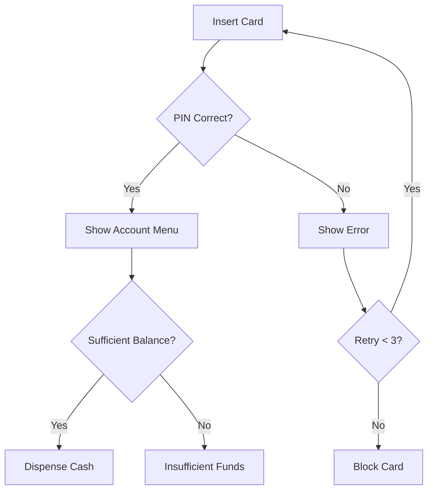
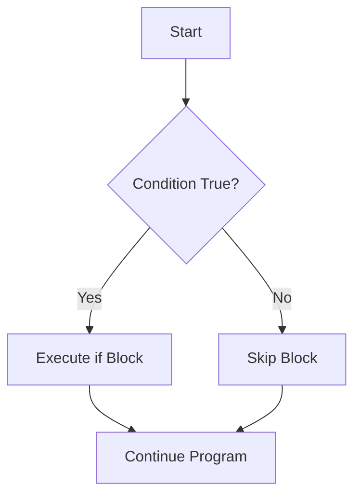
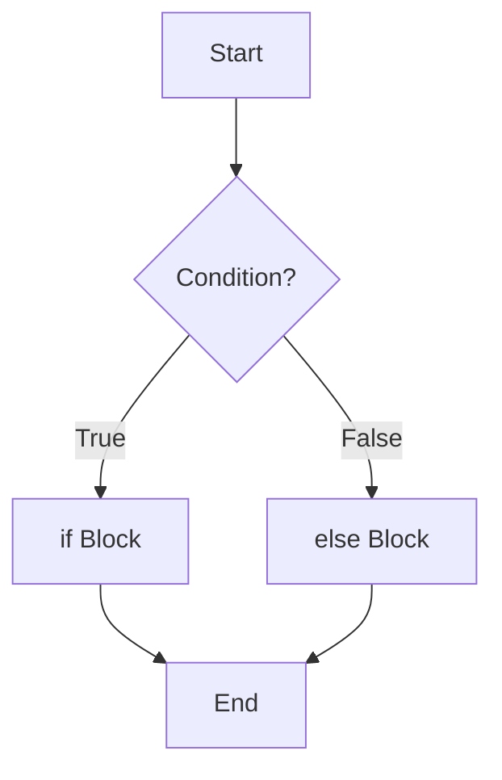
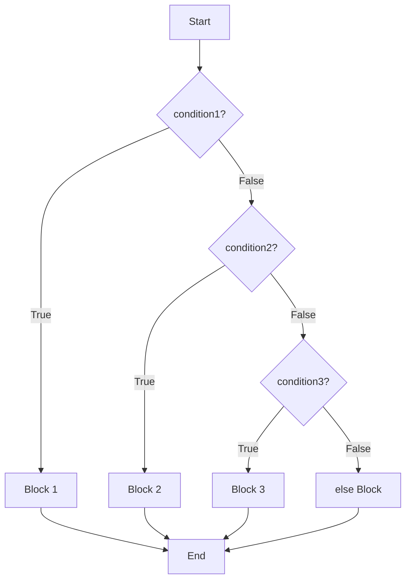
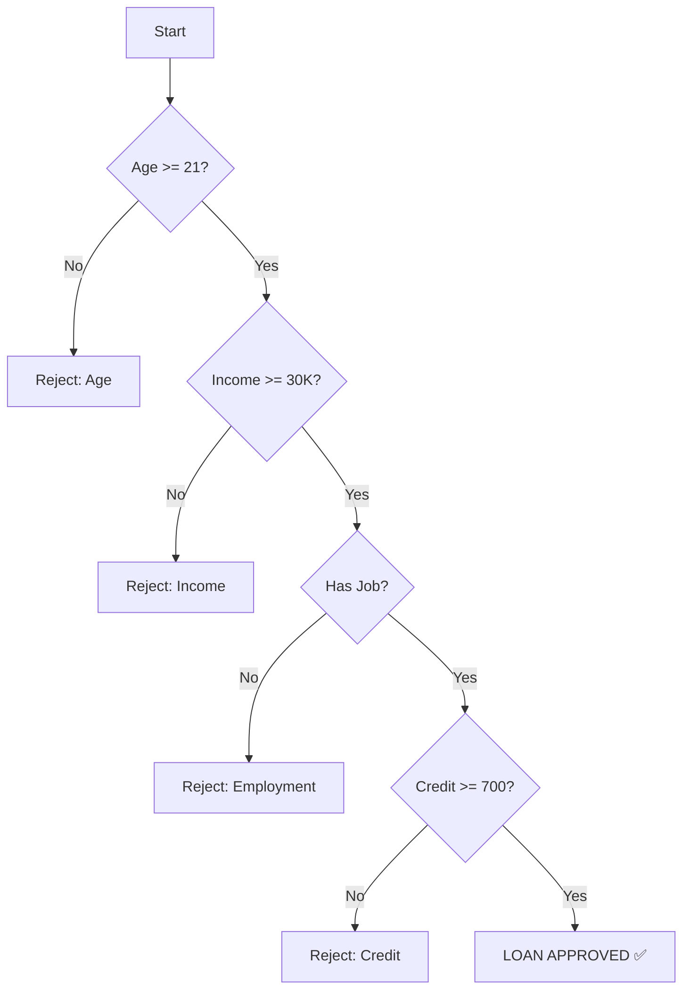

# 🐍 Python Programming — Day 03
# Decision Making, Conditional Statements & Program Flow Control

> **Prerequisites:** Day01 (Python Fundamentals + Operators) | Day02 (Advanced Input, Strings, Memory Model, Debugging)
> **Next Up:** Day04 — Loops, Iteration & Pattern Printing

---

## 📋 Table of Contents

| Section | Topic | Difficulty |
|---------|-------|------------|
| 01 | Day01 + Day02 Revision | 🟢 Easy |
| 02 | Introduction to Program Flow | 🟢 Easy |
| 03 | Boolean Logic Masterclass | 🟢 Easy |
| 04 | Comparison Operators Masterclass | 🟢 Easy |
| 05 | Logical Operators Masterclass | 🟡 Medium |
| 06 | `if` Statement Complete Guide | 🟢 Easy |
| 07 | `if-else` Complete Guide | 🟢 Easy |
| 08 | `if-elif-else` Ladder | 🟡 Medium |
| 09 | Nested `if` | 🟡 Medium |
| 10 | `match-case` Masterclass | 🟡 Medium |
| 11 | Membership Operators in Conditions | 🟢 Easy |
| 12 | Identity Operators in Conditions | 🟡 Medium |
| 13 | Ternary Operator Masterclass | 🟡 Medium |
| 14 | Conditional Design Patterns | 🟠 Hard |
| 15 | Debugging Conditionals | 🟡 Medium |
| 16 | Best Practices | 🟡 Medium |
| 17 | Real World Mini Projects (10) | 🟡 Medium |
| 18 | High Value Portfolio Projects (20) | 🟠 Hard |
| 19 | 200 Practice Questions | All Levels |
| 20 | 100 Interview Questions | All Levels |
| 21 | Assignments (5) | All Levels |
| 22 | Challenge Projects (10) | 🔴 Expert |
| 23 | Day03 Revision & Cheat Sheet | 🟢 Easy |
| 24 | Preparation for Day04 | Preview |

---

# SECTION 01 — DAY01 + DAY02 REVISION

## 🔁 One-Page Quick Revision

### Python Fundamentals Recap

```python
# Variables & Data Types
name = "Shyam"          # str
age = 21                 # int
gpa = 8.5               # float
is_student = True        # bool
nothing = None          # NoneType

# Type Conversion
x = int("42")           # str → int
y = float("3.14")       # str → float
z = str(100)            # int → str
b = bool(0)             # int → bool → False

# Multiple Assignment
a = b = c = 0
x, y, z = 1, 2, 3
first, *rest = [1, 2, 3, 4, 5]
```

---

### ⚡ Operator Cheat Sheet

| Category | Operators | Example | Result |
|----------|-----------|---------|--------|
| Arithmetic | `+ - * / // % **` | `17 // 5` | `3` |
| Assignment | `= += -= *= /=` | `x += 5` | x = x+5 |
| Comparison | `== != > < >= <=` | `5 == 5` | `True` |
| Logical | `and or not` | `True and False` | `False` |
| Bitwise | `& \| ^ ~ << >>` | `5 & 3` | `1` |
| Membership | `in not in` | `'a' in 'abc'` | `True` |
| Identity | `is is not` | `x is None` | depends |

---

### 🔤 String Cheat Sheet

```python
s = "Hello, Python!"

# Common Methods
s.upper()           # "HELLO, PYTHON!"
s.lower()           # "hello, python!"
s.strip()           # removes whitespace
s.replace("H","h")  # "hello, Python!"
s.split(",")        # ["Hello", " Python!"]
s.find("P")         # 7
len(s)              # 14

# Slicing
s[0]        # 'H'
s[-1]       # '!'
s[0:5]      # 'Hello'
s[::2]      # every 2nd char
s[::-1]     # reversed

# f-Strings
print(f"Name: {name}, Age: {age}")
print(f"PI = {3.14159:.2f}")
```

---

### 📥 Input Handling Cheat Sheet

```python
name = input("Enter name: ")           # str
age = int(input("Enter age: "))        # int
price = float(input("Enter price: "))  # float

# Safe Input (try-except from Day02)
try:
    age = int(input("Age: "))
except ValueError:
    print("Please enter a valid number!")

# Multiple values in one line
x, y = map(int, input("Enter x y: ").split())
nums = list(map(int, input("Enter nums: ").split()))
```

---

### 🧠 Day01–02 Mind Map

```
PYTHON FUNDAMENTALS
│
├── Variables → int, float, str, bool, None
├── Operators → Arithmetic, Comparison, Logical, Bitwise
├── Strings → Methods, Slicing, f-strings, Formatting
├── Input → input(), type casting, map(), split()
├── Memory Model → id(), references, mutable vs immutable
└── Debugging → try-except, print debugging, VS Code debugger
```

---

# SECTION 02 — INTRODUCTION TO PROGRAM FLOW

## 🌊 What is Program Flow?

Program flow is the **order in which Python executes statements**. By default, Python runs code top-to-bottom (sequential). But with conditionals, we can **branch** — redirect the execution path based on conditions.

### Types of Program Flow

```
1. Sequential    → Line 1 → Line 2 → Line 3 → ...
2. Conditional   → IF condition THEN do A ELSE do B
3. Iterative     → Repeat a block N times (Day04)
4. Functional    → Jump to a function and return (Day05)
```

---

### Sequential Execution

```python
print("Step 1: Boot System")
print("Step 2: Load Database")
print("Step 3: Start Server")
print("Step 4: Accept Requests")
# Always runs in this order, no branching
```

---

### Decision Making — The Core Idea

```
REAL WORLD: ATM Machine
─────────────────────────────────────────────
You insert card → ATM checks if PIN correct
    IF PIN correct   → Show account menu
    ELSE             → Show error, retry
    IF balance >= withdrawal amount → Dispense
    ELSE → "Insufficient funds"
─────────────────────────────────────────────
```



---

### Real World Flow Examples

| Scenario | Condition | Branch A | Branch B |
|----------|-----------|----------|----------|
| ATM | PIN correct? | Show menu | Error |
| Traffic Signal | Light = RED? | Stop car | Drive |
| Login System | Credentials valid? | Dashboard | Error |
| Online Shopping | Stock available? | Add to cart | Out of stock |
| AI System | Confidence > 90%? | Auto-decide | Ask human |

---

# SECTION 03 — BOOLEAN LOGIC MASTERCLASS

## 🔵 True and False — The Foundation of All Decisions

In Python, **every decision is ultimately a boolean evaluation** — either `True` or `False`.

```python
print(True)   # True
print(False)  # False
print(type(True))   # <class 'bool'>
print(type(False))  # <class 'bool'>
```

### Internal Behavior

> Internally, `True` is stored as integer `1` and `False` as integer `0`.

```python
print(True + True)   # 2
print(True * 5)      # 5
print(False + 10)    # 10
print(True > False)  # True
```

---

## Truthiness and Falsy Values

**Every Python object has a boolean value!** You can check it with `bool()`.

### Falsy Values (evaluate to `False`)

| Value | Type | bool() Result |
|-------|------|---------------|
| `0` | int | False |
| `0.0` | float | False |
| `""` | str | False |
| `[]` | list | False |
| `{}` | dict | False |
| `()` | tuple | False |
| `set()` | set | False |
| `None` | NoneType | False |
| `False` | bool | False |

### Truthy Values (everything else)

```python
bool(1)         # True
bool(-1)        # True (non-zero)
bool("Python")  # True (non-empty string)
bool("0")       # True (non-empty string!)
bool([0])       # True (non-empty list)
bool(" ")       # True (space is non-empty)
```

### ⚠️ Common Trap

```python
# Beginners expect this to be False — it's TRUE!
bool("False")   # True  ← "False" is a non-empty string
bool("0")       # True  ← "0" is a non-empty string

# Only actual Python False/0/empty is falsy
bool(False)     # False
bool(0)         # False
bool("")        # False
```

---

### Truth Tables

#### AND Table

| A | B | A and B |
|---|---|---------|
| T | T | T |
| T | F | F |
| F | T | F |
| F | F | F |

#### OR Table

| A | B | A or B |
|---|---|--------|
| T | T | T |
| T | F | T |
| F | T | T |
| F | F | F |

#### NOT Table

| A | not A |
|---|-------|
| T | F |
| F | T |

---

# SECTION 04 — COMPARISON OPERATORS MASTERCLASS

## 🔍 Deep Dive into Comparison Operators

Comparison operators compare two values and return `True` or `False`.

| Operator | Meaning | Example | Result |
|----------|---------|---------|--------|
| `==` | Equal to | `5 == 5` | True |
| `!=` | Not equal to | `5 != 4` | True |
| `>` | Greater than | `7 > 3` | True |
| `<` | Less than | `3 < 7` | True |
| `>=` | Greater than or equal | `5 >= 5` | True |
| `<=` | Less than or equal | `4 <= 5` | True |

---

### Internal Working

```python
# == calls __eq__() method internally
x = 5
y = 5
print(x == y)           # True
print(x.__eq__(y))      # True (same thing!)

# For custom classes, you can define your own ==
```

### Chaining Comparisons (Python Exclusive!)

```python
age = 25
print(18 <= age <= 60)   # True — Python supports this!
# Equivalent to: 18 <= age AND age <= 60

marks = 85
print(80 <= marks < 90)  # True → Grade B range

x = 5
print(1 < x < 10)        # True
print(1 < x < 4)         # False
```

---

### Edge Cases — Be Careful!

```python
# Float precision issue
print(0.1 + 0.2 == 0.3)  # False! (floating point error)
print(0.1 + 0.2)          # 0.30000000000000004

# Fix:
import math
print(math.isclose(0.1 + 0.2, 0.3))  # True ✅

# String comparison (lexicographic)
print("apple" < "banana")  # True (a < b alphabetically)
print("Z" < "a")           # True (uppercase ASCII < lowercase)
print("10" < "9")          # True! String comparison, not numeric

# Always convert to int for numeric comparison
print(int("10") < int("9"))  # False ✅
```

---

# SECTION 05 — LOGICAL OPERATORS MASTERCLASS

## 🔗 `and`, `or`, `not`

### `and` Operator

Returns `True` only if **both** conditions are `True`.

```python
age = 20
has_id = True

if age >= 18 and has_id:
    print("Entry Allowed")
```

**Short-Circuit Evaluation with `and`:**
> If the **first** condition is `False`, Python **skips** the second condition entirely (because the result can never be `True`).

```python
x = 0
# Python won't even evaluate the right side:
result = x != 0 and (10 / x > 2)  # Safe! No ZeroDivisionError
print(result)  # False
```

---

### `or` Operator

Returns `True` if **at least one** condition is `True`.

```python
is_weekend = True
is_holiday = False

if is_weekend or is_holiday:
    print("Day Off!")
```

**Short-Circuit Evaluation with `or`:**
> If the **first** condition is `True`, Python **skips** the second condition.

```python
name = input("Name: ") or "Anonymous"
# If user enters empty string → "Anonymous"
# If user enters "Shyam" → "Shyam"
print(name)
```

---

### `not` Operator

Reverses the boolean value.

```python
is_logged_in = False

if not is_logged_in:
    print("Please login first.")

# not not = original value
print(not not True)  # True
```

---

### Operator Precedence (Logical)

```
Priority (High → Low):
1. not
2. and
3. or
```

```python
# Without parentheses — can be confusing!
print(True or False and False)
# Reads as: True or (False and False)
#         = True or False
#         = True

# Always use parentheses for clarity:
print(True or (False and False))  # True ✅
```

---

### Real World: Login System Logic

```python
username = "admin"
password = "secure123"
is_active = True

user_input_user = "admin"
user_input_pass = "secure123"

if (username == user_input_user and 
    password == user_input_pass and 
    is_active):
    print("✅ Login Successful")
else:
    print("❌ Login Failed")
```

---

# SECTION 06 — `if` STATEMENT COMPLETE GUIDE

## 📌 What is `if`?

The `if` statement allows Python to **execute a block of code only when a condition is True**. If the condition is False, the block is skipped entirely.

### Syntax

```python
if condition:
    # indented block
    # runs ONLY if condition is True
```

> **Critical Rule:** Python uses **indentation** (4 spaces or 1 tab) to define code blocks. This is NOT optional!

---

### Flowchart



---

### Examples

```python
# Basic if
temperature = 38
if temperature > 37:
    print("Fever detected!")
    print("Please rest and drink water.")

# if with complex condition
bank_balance = 5000
withdrawal = 3000
if bank_balance >= withdrawal:
    bank_balance -= withdrawal
    print(f"Withdrawn ₹{withdrawal}. Balance: ₹{bank_balance}")
```

---

### Indentation Rules

```python
# ✅ CORRECT — 4 spaces
if True:
    print("Correct")

# ❌ WRONG — No indentation
if True:
print("Wrong")  # IndentationError!

# ❌ WRONG — Mixed indentation
if True:
    print("Line 1")
  print("Line 2")   # IndentationError! (inconsistent)
```

---

### Common Mistakes

```python
# ❌ Using = instead of ==
if x = 5:   # SyntaxError! Use == for comparison
    print("Five")

# ✅ Correct
if x == 5:
    print("Five")

# ❌ Forgetting the colon
if x == 5    # SyntaxError!
    print("Five")

# ✅ Correct
if x == 5:
    print("Five")
```

---

# SECTION 07 — `if-else` COMPLETE GUIDE

## 🔀 Two-Path Decision Making

When you need to handle **both the True case AND the False case**, use `if-else`.

### Syntax

```python
if condition:
    # runs when condition is True
else:
    # runs when condition is False
```

### Flowchart



---

### Examples

```python
# Example 1: Voting Eligibility
age = int(input("Enter your age: "))
if age >= 18:
    print("✅ You are eligible to vote.")
else:
    print("❌ You are not eligible to vote yet.")

# Example 2: ATM Withdrawal
balance = 5000
amount = int(input("Enter withdrawal amount: "))
if balance >= amount:
    balance -= amount
    print(f"✅ Dispensed ₹{amount}. Remaining: ₹{balance}")
else:
    print(f"❌ Insufficient balance. Available: ₹{balance}")

# Example 3: Even or Odd
num = int(input("Enter a number: "))
if num % 2 == 0:
    print(f"{num} is Even")
else:
    print(f"{num} is Odd")
```

---

### Decision Trees

```
User enters age
       │
       ▼
   age >= 18?
   ┌────┴────┐
  YES       NO
   │         │
   ▼         ▼
"Can Vote" "Cannot Vote"
```

---

### Real World Analogy

> Think of `if-else` as a **railway junction**. The train (execution) approaches a fork. Based on the signal (condition), it goes LEFT (True branch) or RIGHT (False branch). It CANNOT go both ways.

---

# SECTION 08 — `if-elif-else` LADDER

## 🪜 Multi-Path Decision Making

When you have **more than 2 outcomes**, use `elif` (else-if).

### Syntax

```python
if condition1:
    # block 1
elif condition2:
    # block 2
elif condition3:
    # block 3
else:
    # default block (if all above fail)
```

---

### Flowchart



---

### Internal Execution — Key Rule

> Python checks conditions **top to bottom** and **executes the FIRST matching block**, then **exits the entire ladder**. It does NOT check remaining conditions.

```python
marks = 85

if marks >= 90:
    print("Grade: A+")      # 85 >= 90? NO
elif marks >= 80:
    print("Grade: A")       # 85 >= 80? YES → runs this
elif marks >= 70:
    print("Grade: B")       # SKIPPED (first match already found)
elif marks >= 60:
    print("Grade: C")       # SKIPPED
else:
    print("Grade: Fail")    # SKIPPED

# Output: Grade: A
```

---

### Complete Grade System

```python
def get_grade(marks):
    if marks >= 90:
        return "A+ (Outstanding)"
    elif marks >= 80:
        return "A (Excellent)"
    elif marks >= 70:
        return "B (Good)"
    elif marks >= 60:
        return "C (Average)"
    elif marks >= 50:
        return "D (Pass)"
    else:
        return "F (Fail)"

marks = int(input("Enter marks (0-100): "))
if 0 <= marks <= 100:
    print(f"Your Grade: {get_grade(marks)}")
else:
    print("Invalid marks! Enter between 0 and 100.")
```

---

### Performance Consideration

> Put the **most likely** condition FIRST. Python stops checking once a match is found.

```python
# If 90% of users are "Regular" customers:
# ❌ Inefficient (checks Premium and VIP first every time)
if tier == "Premium":
    discount = 0.20
elif tier == "VIP":
    discount = 0.30
elif tier == "Regular":
    discount = 0.05

# ✅ Efficient (most common case first)
if tier == "Regular":
    discount = 0.05
elif tier == "Premium":
    discount = 0.20
elif tier == "VIP":
    discount = 0.30
```

---

# SECTION 09 — NESTED `if`

## 🪆 Conditions Inside Conditions

Nested `if` means placing an `if` statement **inside another `if` block**.

### Syntax

```python
if outer_condition:
    if inner_condition:
        # runs only when BOTH are True
```

---

### When to Use Nested `if`

Use nested `if` when a second decision **only makes sense** after a first condition passes.

```python
# Example: Loan Application
age = 25
income = 50000
has_job = True
credit_score = 720

if age >= 21:
    print("✅ Age Requirement Met")
    if income >= 30000:
        print("✅ Income Requirement Met")
        if has_job:
            print("✅ Employment Verified")
            if credit_score >= 700:
                print("🎉 LOAN APPROVED!")
            else:
                print("❌ Credit score too low")
        else:
            print("❌ No employment proof")
    else:
        print("❌ Income too low")
else:
    print("❌ Age requirement not met")
```

---

### Flowchart



---

### ⚠️ Disadvantages of Deep Nesting

```python
# ❌ Pyramid of Doom — avoid beyond 3 levels
if a:
    if b:
        if c:
            if d:
                if e:
                    print("Finally!")  # Very hard to read/debug
```

**Refactoring with `and`:**

```python
# ✅ Much better — flat and readable
if a and b and c and d and e:
    print("Finally!")
```

---

# SECTION 10 — `match-case` MASTERCLASS

## 🎯 Pattern Matching (Python 3.10+)

Python 3.10 introduced `match-case` — Python's version of a `switch` statement, but much more powerful.

### Syntax

```python
match variable:
    case value1:
        # block 1
    case value2:
        # block 2
    case _:          # wildcard (default)
        # default block
```

---

### Basic Example

```python
day = int(input("Enter day number (1-7): "))

match day:
    case 1:
        print("Monday 😴")
    case 2:
        print("Tuesday")
    case 3:
        print("Wednesday")
    case 4:
        print("Thursday")
    case 5:
        print("Friday 🎉")
    case 6 | 7:           # OR pattern
        print("Weekend! 🥳")
    case _:
        print("Invalid day number")
```

---

### Multiple Values in One Case

```python
status_code = 404

match status_code:
    case 200 | 201 | 202:
        print("✅ Success")
    case 301 | 302:
        print("🔀 Redirect")
    case 400:
        print("❌ Bad Request")
    case 401 | 403:
        print("🔒 Auth Error")
    case 404:
        print("🔍 Not Found")
    case 500 | 502 | 503:
        print("💥 Server Error")
    case _:
        print("❓ Unknown Status")
```

---

### Guards in match-case

```python
score = 75

match score:
    case s if s >= 90:
        print(f"Grade A+ ({s})")
    case s if s >= 80:
        print(f"Grade A ({s})")
    case s if s >= 70:
        print(f"Grade B ({s})")
    case _:
        print("Needs improvement")
```

---

### `match-case` vs `if-elif` Comparison

| Feature | `if-elif` | `match-case` |
|---------|-----------|--------------|
| Python Version | All | 3.10+ |
| Pattern Matching | No | Yes |
| Guard Conditions | No (needs and) | Yes (`if` in case) |
| Readability | Verbose | Cleaner |
| Destructuring | No | Yes |
| Wildcard | else | `case _:` |
| Multiple values | `a == 1 or a == 2` | `case 1 \| 2:` |

---

# SECTION 11 — MEMBERSHIP OPERATORS IN CONDITIONS

## 🔍 `in` and `not in`

Membership operators check if a value **exists in a collection**.

### Syntax

```python
value in collection       # True if value found
value not in collection   # True if value NOT found
```

---

### With Strings

```python
email = "shyam@gmail.com"

if "@" in email and "." in email:
    print("✅ Valid email format")
else:
    print("❌ Invalid email")

vowels = "aeiou"
char = "e"
if char in vowels:
    print(f"'{char}' is a vowel")
```

---

### With Lists

```python
allowed_roles = ["admin", "moderator", "editor"]
user_role = "admin"

if user_role in allowed_roles:
    print("✅ Access Granted")
else:
    print("❌ Access Denied")

blocked_users = ["spammer1", "bot99", "hacker"]
username = "shyam"

if username not in blocked_users:
    print("✅ User allowed")
else:
    print("❌ User is blocked")
```

---

### With Dictionaries

```python
student = {"name": "Shyam", "age": 21, "gpa": 8.5}

if "gpa" in student:
    print(f"GPA: {student['gpa']}")

# By default, `in` checks KEYS in a dict
if "name" in student:
    print("Name field exists")

# Check values:
if "Shyam" in student.values():
    print("Shyam found in values")
```

---

# SECTION 12 — IDENTITY OPERATORS IN CONDITIONS

## 🪪 `is` and `is not`

Identity operators check if two variables **point to the SAME object in memory** — NOT just equal values.

### Key Difference: `==` vs `is`

```python
a = [1, 2, 3]
b = [1, 2, 3]
c = a

print(a == b)    # True  → same VALUE
print(a is b)    # False → different objects in memory!
print(a is c)    # True  → c is just another name for a

print(id(a))     # e.g. 140234567890
print(id(b))     # e.g. 140234567920  (different!)
print(id(c))     # same as id(a) ✅
```

---

### Primary Use Case: `None` Check

```python
# ✅ ALWAYS use `is` to check None
result = None

if result is None:
    print("No result found")

if result is not None:
    print(f"Result: {result}")

# ❌ Technically works but not recommended:
if result == None:
    print("No result")  # Works but considered bad style
```

---

### Small Integer Caching (CPython)

```python
# CPython caches integers -5 to 256
x = 256
y = 256
print(x is y)    # True (cached)

x = 257
y = 257
print(x is y)    # False (not cached — different objects)
print(x == y)    # True (same value)
```

> **Interview Tip:** This is implementation-specific (CPython). Never rely on `is` for value comparison — always use `==`.

---

# SECTION 13 — TERNARY OPERATOR MASTERCLASS

## ⚡ One-Line Conditional Expression

The ternary operator condenses a simple `if-else` into a **single line**.

### Syntax

```python
value_if_true if condition else value_if_false
```

---

### Comparison: Normal vs Ternary

```python
# Normal if-else (4 lines)
age = 20
if age >= 18:
    status = "Adult"
else:
    status = "Minor"

# Ternary (1 line) ✨
status = "Adult" if age >= 18 else "Minor"
print(status)  # Adult
```

---

### Real World Examples

```python
# Grade
marks = 75
result = "Pass" if marks >= 40 else "Fail"

# Max of two numbers
a, b = 10, 20
maximum = a if a > b else b

# Absolute value
num = -5
absolute = num if num >= 0 else -num

# Login greeting
username = "shyam"
greeting = f"Welcome back, {username}!" if username else "Hello, Guest!"

# Discount
price = 1000
discount = 0.20 if price > 500 else 0.10
final_price = price * (1 - discount)
print(f"Final Price: ₹{final_price}")
```

---

### Nested Ternary (Use with Caution!)

```python
# ❌ Hard to read — avoid in production
grade = "A" if marks >= 90 else "B" if marks >= 80 else "C" if marks >= 70 else "F"

# ✅ Better: use if-elif for multiple conditions
```

---

### Best Practices

```python
# ✅ Good: Simple, readable
is_even = "Even" if num % 2 == 0 else "Odd"

# ❌ Bad: Too complex for ternary
# Use regular if-else for complex logic
result = (process_a(x) if x > 100 else process_b(x)) if x is not None else "N/A"
# This is unreadable — use if-elif-else instead
```

---

# SECTION 14 — CONDITIONAL DESIGN PATTERNS

## 🏗️ Real Patterns Used in Industry

### 1. Input Validation Pattern

```python
def validate_age(age_str):
    try:
        age = int(age_str)
        if age < 0:
            return None, "Age cannot be negative"
        if age > 150:
            return None, "Age seems unrealistic"
        return age, None
    except ValueError:
        return None, "Age must be a number"

age_input = input("Enter age: ")
age, error = validate_age(age_input)
if error:
    print(f"❌ Error: {error}")
else:
    print(f"✅ Valid age: {age}")
```

---

### 2. Menu System Pattern

```python
print("=== MAIN MENU ===")
print("1. View Profile")
print("2. Edit Settings")
print("3. Logout")

choice = input("Enter choice: ")

if choice == "1":
    print("Loading profile...")
elif choice == "2":
    print("Loading settings...")
elif choice == "3":
    print("Logging out...")
else:
    print("❌ Invalid choice. Please try again.")
```

---

### 3. Role-Based Access Control

```python
user_role = "editor"
action = "publish"

permissions = {
    "admin":     ["read", "write", "delete", "publish"],
    "editor":    ["read", "write", "publish"],
    "author":    ["read", "write"],
    "viewer":    ["read"]
}

if user_role in permissions:
    if action in permissions[user_role]:
        print(f"✅ {user_role.title()} can {action}")
    else:
        print(f"❌ {user_role.title()} cannot {action}")
else:
    print("❌ Unknown role")
```

---

### 4. Eligibility System Pattern

```python
def check_scholarship_eligibility(marks, income, attendance):
    reasons = []
    
    if marks < 80:
        reasons.append(f"Marks {marks}% < required 80%")
    if income > 300000:
        reasons.append(f"Income ₹{income} > limit ₹3,00,000")
    if attendance < 75:
        reasons.append(f"Attendance {attendance}% < required 75%")
    
    if not reasons:
        return True, "All criteria met ✅"
    else:
        return False, "Rejected: " + " | ".join(reasons)

eligible, msg = check_scholarship_eligibility(85, 250000, 80)
print(f"Scholarship: {'Approved' if eligible else 'Rejected'}")
print(msg)
```

---

### 5. Decision Engine Pattern

```python
def recommend_course(age, background, budget):
    if age < 18:
        if budget > 50000:
            return "Premium School Bootcamp"
        else:
            return "Free Online Resources (freeCodeCamp)"
    elif age < 30:
        if background == "engineering":
            if budget > 100000:
                return "IIT PGDML / upGrad"
            else:
                return "Coursera Andrew Ng + Projects"
        else:
            return "Fundamentals First: CS50 + Python"
    else:
        return "Professional Certification: AWS/GCP/Azure AI"

recommendation = recommend_course(21, "engineering", 80000)
print(f"Recommended Course: {recommendation}")
```

---

# SECTION 15 — DEBUGGING CONDITIONALS

## 🐛 Types of Errors

### 1. Syntax Errors

```python
# ❌ Missing colon
if x > 5
    print("Yes")

# ❌ Wrong comparison operator
if x = 5:
    print("Five")

# ❌ Missing indentation
if x > 5:
print("Yes")
```

---

### 2. Logical Errors (Hardest to Find!)

```python
# ❌ Wrong operator — overlapping ranges
marks = 85
if marks >= 80:
    grade = "A"
if marks >= 70:     # ← Should be elif!
    grade = "B"     # This OVERWRITES grade A!

print(grade)  # B  ← Wrong!

# ✅ Correct:
if marks >= 80:
    grade = "A"
elif marks >= 70:   # Only reaches here if above was False
    grade = "B"
```

---

### 3. Runtime Errors

```python
data = None

# ❌ NoneType error
if data.upper() == "YES":    # AttributeError!
    print("Yes")

# ✅ Safe check first
if data is not None and data.upper() == "YES":
    print("Yes")

# ✅ Or use ternary
result = data.upper() if data else "NO DATA"
```

---

### Debugging Techniques

```python
# 1. Print debugging
condition = age >= 18
print(f"DEBUG: age={age}, condition={condition}")

# 2. assert statements
assert age >= 0, f"Age cannot be negative: {age}"

# 3. Type checking
print(f"Type of age: {type(age)}")
print(f"Value of age: {age}")
```

---

# SECTION 16 — BEST PRACTICES

## ✅ Writing Clean Conditional Code

### 1. Avoid Deep Nesting — Use Early Returns

```python
# ❌ Deeply nested (Pyramid of Doom)
def process_user(user):
    if user is not None:
        if user.is_active:
            if user.has_permission:
                return "Process Complete"

# ✅ Early return pattern (Guard Clauses)
def process_user(user):
    if user is None:
        return "No user"
    if not user.is_active:
        return "User inactive"
    if not user.has_permission:
        return "No permission"
    return "Process Complete"
```

---

### 2. Use Meaningful Boolean Variable Names

```python
# ❌ Unclear
if x:
    pass

# ✅ Clear
is_authenticated = True
has_premium = False
can_delete = True

if is_authenticated and has_premium:
    show_premium_content()
```

---

### 3. Simplify Boolean Returns

```python
# ❌ Unnecessary if-else
def is_adult(age):
    if age >= 18:
        return True
    else:
        return False

# ✅ Direct boolean return
def is_adult(age):
    return age >= 18
```

---

### 4. PEP8 Style

```python
# ✅ Spaces around operators
if x == 5:

# ✅ Max line length 79 chars — break long conditions
if (very_long_condition_one and
        very_long_condition_two and
        very_long_condition_three):
    pass

# ✅ Avoid comparing booleans explicitly
is_valid = True
if is_valid:          # ✅
    pass
if is_valid == True:  # ❌ Redundant
    pass
```

---

# SECTION 17 — REAL WORLD MINI PROJECTS

## Project 1: Voting Eligibility Checker

```
Problem: Check if a person can vote based on age and citizenship.
```

```python
print("=" * 40)
print("    ELECTION COMMISSION OF INDIA")
print("    VOTER ELIGIBILITY CHECKER")
print("=" * 40)

name = input("Enter your name: ")
age = int(input("Enter your age: "))
is_citizen = input("Are you an Indian citizen? (yes/no): ").lower()

print("\n--- ELIGIBILITY REPORT ---")
if is_citizen == "yes":
    if age >= 18:
        print(f"✅ {name}, you are ELIGIBLE to vote!")
        print("Please carry your Voter ID to the polling booth.")
    else:
        years_left = 18 - age
        print(f"❌ {name}, you are NOT eligible yet.")
        print(f"You can vote after {years_left} year(s).")
else:
    print(f"❌ {name}, only Indian citizens can vote.")
```

---

## Project 2: Student Grade Calculator

```python
print("=" * 40)
print("    STUDENT GRADE CALCULATOR")
print("=" * 40)

name = input("Enter student name: ")
subjects = ["Mathematics", "Physics", "Chemistry", "English", "Computer Science"]
total = 0

for subject in subjects:
    while True:
        try:
            marks = float(input(f"Enter marks for {subject} (0-100): "))
            if 0 <= marks <= 100:
                total += marks
                break
            else:
                print("❌ Marks must be between 0 and 100")
        except ValueError:
            print("❌ Please enter a valid number")

average = total / len(subjects)

if average >= 90:
    grade = "A+"
    remark = "Outstanding! 🌟"
elif average >= 80:
    grade = "A"
    remark = "Excellent! 🎉"
elif average >= 70:
    grade = "B"
    remark = "Good Work! 👍"
elif average >= 60:
    grade = "C"
    remark = "Average. Keep improving!"
elif average >= 40:
    grade = "D"
    remark = "Just passed. Study harder!"
else:
    grade = "F"
    remark = "Failed. Please reappear."

print(f"\n{'='*40}")
print(f"REPORT CARD — {name}")
print(f"Total Marks: {total}/{len(subjects)*100}")
print(f"Average: {average:.2f}%")
print(f"Grade: {grade}")
print(f"Remark: {remark}")
```

---

## Project 3: Smart Login System

```python
# Simulated user database
USERS = {
    "admin": {"password": "admin@123", "role": "admin"},
    "shyam": {"password": "shyam#456", "role": "user"},
    "editor": {"password": "edit!789", "role": "editor"}
}

MAX_ATTEMPTS = 3
attempts = 0

print("=" * 40)
print("        SECURE LOGIN SYSTEM")
print("=" * 40)

while attempts < MAX_ATTEMPTS:
    username = input("Username: ")
    password = input("Password: ")
    attempts += 1
    
    if username in USERS:
        if USERS[username]["password"] == password:
            role = USERS[username]["role"]
            print(f"\n✅ Login Successful!")
            print(f"Welcome, {username.title()}! Role: {role.upper()}")
            if role == "admin":
                print("🔧 You have FULL system access.")
            elif role == "editor":
                print("✏️ You can edit content.")
            else:
                print("👀 You have read-only access.")
            break
        else:
            remaining = MAX_ATTEMPTS - attempts
            print(f"❌ Wrong password. {remaining} attempt(s) remaining.")
    else:
        remaining = MAX_ATTEMPTS - attempts
        print(f"❌ User not found. {remaining} attempt(s) remaining.")
else:
    print("\n🚫 Account LOCKED! Too many failed attempts.")
```

---

## Project 4: ATM Menu Simulator

```python
balance = 50000.0

print("=" * 40)
print("    NATIONAL BANK OF INDIA ATM")
print("=" * 40)

pin = input("Enter your 4-digit PIN: ")
if pin != "1234":
    print("❌ Wrong PIN. Card retained.")
else:
    print("✅ PIN Verified\n")
    print("1. Check Balance")
    print("2. Withdraw")
    print("3. Deposit")
    print("4. Exit")
    
    choice = input("\nEnter choice: ")
    
    if choice == "1":
        print(f"\n💰 Current Balance: ₹{balance:,.2f}")
    elif choice == "2":
        amount = float(input("Withdraw amount: ₹"))
        if amount <= 0:
            print("❌ Invalid amount")
        elif amount > balance:
            print(f"❌ Insufficient funds. Available: ₹{balance:,.2f}")
        elif amount > 20000:
            print("❌ Daily withdrawal limit is ₹20,000")
        else:
            balance -= amount
            print(f"✅ Dispensed ₹{amount:,.2f}. New balance: ₹{balance:,.2f}")
    elif choice == "3":
        amount = float(input("Deposit amount: ₹"))
        if amount <= 0:
            print("❌ Invalid amount")
        else:
            balance += amount
            print(f"✅ Deposited ₹{amount:,.2f}. New balance: ₹{balance:,.2f}")
    elif choice == "4":
        print("Thank you for using NBI ATM! Goodbye.")
    else:
        print("❌ Invalid choice")
```

---

## Project 5: BMI Calculator & Category Checker

```python
print("=" * 40)
print("       BMI CALCULATOR")
print("=" * 40)

weight = float(input("Enter weight in kg: "))
height = float(input("Enter height in meters: "))

if weight <= 0 or height <= 0:
    print("❌ Weight and height must be positive")
else:
    bmi = weight / (height ** 2)
    
    if bmi < 18.5:
        category = "Underweight 🟡"
        advice = "Increase calorie intake and consult a doctor."
    elif bmi < 25.0:
        category = "Normal Weight ✅"
        advice = "Great! Maintain your current lifestyle."
    elif bmi < 30.0:
        category = "Overweight 🟠"
        advice = "Increase physical activity and watch diet."
    else:
        category = "Obese 🔴"
        advice = "Please consult a healthcare professional immediately."
    
    print(f"\nBMI Score: {bmi:.2f}")
    print(f"Category: {category}")
    print(f"Advice: {advice}")
```

---

## Project 6: Movie Ticket Eligibility System

```python
print("=" * 40)
print("    CINEMA HALL TICKET SYSTEM")
print("=" * 40)

movie = "Animal"
rating = "A"  # A = Adults Only, U = Universal, UA = 12+

age = int(input("Enter your age: "))
has_guardian = input("Are you with a guardian? (yes/no): ").lower() == "yes"

print(f"\nMovie: {movie} | Rating: {rating}")

if rating == "U":
    print("✅ All ages welcome! Enjoy the show.")
elif rating == "UA":
    if age >= 12:
        print("✅ You can watch this film.")
    elif has_guardian:
        print("✅ Entry allowed with guardian.")
    else:
        print("❌ This film is rated UA. Children under 12 need a guardian.")
elif rating == "A":
    if age >= 18:
        print("✅ You can watch this adults-only film.")
    else:
        print(f"❌ This film is rated A (Adults Only). You need to be 18+.")
```

---

## Project 7–10 (Quick Summary with Key Logic)

```python
# Project 7: Scholarship Eligibility
# Logic: marks >= 85 AND income < 500000 AND attendance >= 80

# Project 8: Driving License Eligibility
# Logic: age >= 18 AND passed_test AND no_criminal_record

# Project 9: College Admission Checker
# Logic: JEE rank, category (General/OBC/SC/ST), income, preference

# Project 10: Employee Bonus Calculator
# Logic: performance_rating AND years_of_service AND department
```

---

# SECTION 18 — HIGH VALUE PORTFOLIO PROJECTS

| # | Project | Difficulty | Skills | Real World Value |
|---|---------|------------|--------|-----------------|
| 1 | Smart Rule Engine | ⭐⭐⭐ | Logic design | Automation |
| 2 | Career Recommendation System | ⭐⭐⭐ | Decision trees | EdTech |
| 3 | AI Decision Simulator | ⭐⭐⭐⭐ | AI logic | Industry 4.0 |
| 4 | Admission Management | ⭐⭐⭐ | Form validation | Education |
| 5 | Insurance Eligibility | ⭐⭐⭐ | Risk logic | FinTech |
| 6 | Loan Approval | ⭐⭐⭐ | Credit logic | Banking |
| 7 | Employee Promotion Engine | ⭐⭐ | HR logic | Enterprise |
| 8 | Exam Result Analyzer | ⭐⭐ | Data logic | Education |
| 9 | Smart Form Validator | ⭐⭐⭐ | Validation | Web Dev |
| 10 | Scholarship Portal | ⭐⭐⭐ | Eligibility | GovTech |
| 11 | Hospital Triage | ⭐⭐⭐⭐ | Medical logic | HealthTech |
| 12 | Traffic Violation Detector | ⭐⭐⭐ | Rule engine | Smart City |
| 13 | Smart Pricing Engine | ⭐⭐⭐ | Business logic | E-commerce |
| 14 | Cybersecurity Access System | ⭐⭐⭐⭐ | Security | Infosec |
| 15 | Flight Booking Eligibility | ⭐⭐⭐ | Business rules | Aviation |
| 16 | Tax Calculator | ⭐⭐⭐ | Finance logic | FinTech |
| 17 | Sports Team Selector | ⭐⭐ | Selection logic | Sports |
| 18 | Food Recommendation | ⭐⭐ | Preference logic | FoodTech |
| 19 | Smart Interview Screener | ⭐⭐⭐⭐ | HR + AI | HRTech |
| 20 | Enterprise IAM System | ⭐⭐⭐⭐⭐ | Access control | Enterprise |

### Project 3: AI Decision Simulator (Full Code)

```python
"""
AI DECISION SIMULATOR
Simulates how a rule-based AI makes decisions
"""

def ai_decision_engine(inputs):
    """
    Simulates a rule-based AI decision system
    inputs: dict with user data
    """
    confidence = 0
    decision_log = []
    
    # Rule 1: Age factor
    if inputs["age"] >= 21 and inputs["age"] <= 45:
        confidence += 25
        decision_log.append("✅ Age in optimal range (+25)")
    elif inputs["age"] > 45:
        confidence += 15
        decision_log.append("⚡ Experienced candidate (+15)")
    else:
        confidence += 5
        decision_log.append("⚠️ Young candidate (+5)")
    
    # Rule 2: Education
    if inputs["education"] == "PhD":
        confidence += 30
        decision_log.append("✅ PhD qualification (+30)")
    elif inputs["education"] == "Masters":
        confidence += 22
        decision_log.append("✅ Masters qualification (+22)")
    elif inputs["education"] == "Bachelors":
        confidence += 15
        decision_log.append("✅ Bachelors qualification (+15)")
    else:
        confidence += 5
        decision_log.append("⚠️ Basic education (+5)")
    
    # Rule 3: Experience
    if inputs["experience"] >= 5:
        confidence += 25
        decision_log.append("✅ 5+ years experience (+25)")
    elif inputs["experience"] >= 2:
        confidence += 15
        decision_log.append("✅ 2+ years experience (+15)")
    else:
        confidence += 5
        decision_log.append("⚠️ Entry level (+5)")
    
    # Rule 4: Skills match
    required_skills = {"Python", "ML", "SQL"}
    candidate_skills = set(inputs["skills"])
    match_count = len(required_skills & candidate_skills)
    skill_bonus = match_count * 7
    confidence += skill_bonus
    decision_log.append(f"✅ Skills match: {match_count}/3 (+{skill_bonus})")
    
    # Final Decision
    if confidence >= 80:
        decision = "STRONG HIRE ✅"
    elif confidence >= 60:
        decision = "RECOMMENDED FOR INTERVIEW 🎯"
    elif confidence >= 40:
        decision = "CONSIDER WITH RESERVATIONS ⚡"
    else:
        decision = "REJECT ❌"
    
    return decision, confidence, decision_log


# Test the engine
candidate = {
    "name": "Shyam",
    "age": 22,
    "education": "Bachelors",
    "experience": 1,
    "skills": ["Python", "ML", "Django"]
}

decision, score, logs = ai_decision_engine(candidate)
print(f"\n🤖 AI DECISION ENGINE — {candidate['name']}")
print("=" * 50)
for log in logs:
    print(log)
print(f"\nConfidence Score: {score}/100")
print(f"Decision: {decision}")
```

---

# SECTION 19 — 200 PRACTICE QUESTIONS

## 🟢 Easy (80 Questions)

### Boolean Logic

1. What does `bool(0)` return?
2. What does `bool([])` return?
3. What does `bool("False")` return? (Trick question!)
4. What is the result of `True + True`?
5. What is the result of `True * 3`?
6. Is `None` truthy or falsy?
7. Is `" "` (space) truthy or falsy?
8. What does `bool({})` return?
9. What does `not False` evaluate to?
10. What does `not not True` evaluate to?

### Comparison Operators

11. What does `5 == 5.0` return?
12. What does `"5" == 5` return?
13. What does `"apple" < "banana"` return?
14. What does `10 != 10` return?
15. Is `1 < 2 < 3` valid Python? What does it return?
16. What does `0.1 + 0.2 == 0.3` return and why?
17. What does `True == 1` return?
18. What does `False == 0` return?
19. What does `"Z" < "a"` return?
20. What does `type(True) == type(1)` return?

### if Statement

21. Write an `if` that prints "Hot" if temperature > 35.
22. What happens if an `if` condition is `0`?
23. Write an `if` that checks if a number is positive.
24. What error occurs with missing indentation?
25. What symbol ends an `if` statement line?

### if-else

26. Write code to check if a number is even or odd.
27. Write code to find the larger of two numbers.
28. Write code to check if a string is empty.
29. What runs if the `if` condition is `False`?
30. Can `else` have a condition? Why or why not?

### if-elif-else

31. Write a grade system with 5 levels (A, B, C, D, F).
32. How many `elif` blocks can you have?
33. Is `else` required with `elif`?
34. Write a day-of-week checker (1-7 → Monday-Sunday).
35. Write a season checker based on month number.

### Logical Operators

36. What does `True and False` return?
37. What does `False or True` return?
38. What does `not True` return?
39. What is "short circuit evaluation"?
40. Which has higher precedence: `and` or `or`?

### Membership Operators

41. Does `"a" in "apple"` return True?
42. Does `5 in [1, 2, 3]` return True?
43. Does `"x" not in "python"` return True?
44. Does `"key" in {"key": "value"}` return True?
45. Does `"value" in {"key": "value"}` return True?

### Identity Operators

46. What does `None is None` return?
47. `a = [1,2]; b = [1,2]`. Is `a is b` True?
48. `a = [1,2]; b = a`. Is `a is b` True?
49. When should you use `is` vs `==`?
50. What does `is not` do?

### Ternary Operator

51. Rewrite this as ternary: `if x > 0: sign = "positive" else: sign = "negative"`
52. Can you nest ternary operators?
53. What type does a ternary expression return?
54. Write ternary for absolute value of `n`.
55. Write ternary to check if a list is empty.

### Miscellaneous Easy

56. What is `and`'s result when first is False?
57. What is `or`'s result when first is True?
58. Name 5 falsy values in Python.
59. What does `if x:` check?
60. Write: print "Positive", "Negative", or "Zero" for a number.
61. Can if-block be empty? How?
62. What is the `pass` statement used for?
63. Check if age is between 18 and 60 (inclusive) in one line.
64. What does `"" or "default"` evaluate to?
65. What does `"value" and "other"` evaluate to?
66. Write an if that only runs for admin users.
67. Check if a year is a leap year.
68. Write code to check if a character is a vowel.
69. Check if a number is divisible by both 3 and 5.
70. Is `elif` short for "else if"?
71. Can you have `else` without `if`?
72. What does `bool(None)` return?
73. What does `bool(-1)` return?
74. Write code: if username starts with "@", add prefix "handle:".
75. What is the output: `x = 5; print("yes") if x > 3 else print("no")`?
76. What does `not "hello"` return?
77. Write code to check if a password has more than 8 characters.
78. What is the output: `print(1 > 0 > -1)`?
79. What does `"a" < "b" < "c"` return?
80. Write a ternary that returns "Pass" if marks >= 40, else "Fail".

---

## 🟡 Medium (80 Questions)

81. Explain the difference between `==` and `is` with an example.
82. Why does `0.1 + 0.2 != 0.3`? How do you fix it?
83. What is short-circuit evaluation? Give an example where it prevents an error.
84. Write a function that validates email format using conditions.
85. Implement FizzBuzz for a single number (not a loop).
86. Create a BMI calculator that returns category as a string.
87. What is the output? `print(None or [] or 0 or "Python")`
88. What is the output? `print(1 and 2 and 3)`
89. Implement a ternary-only grade calculator.
90. What is the output? `print("" or False or 0 or None or "last")`
91. What happens when you compare different types with `>`?
92. Write a role-based access check using a dictionary.
93. What does `x = None; y = x or 5` evaluate y to?
94. Create a nested if for airline booking (age + class + discount).
95. Why is `if x == True:` worse than `if x:`?
96. Rewrite deep nesting using early returns.
97. What is the output? `x=5; y = "big" if x > 3 else "small"; print(y)`
98. How does Python evaluate `a and b or c`?
99. Create a loan eligibility system with 4 conditions.
100. Implement a simple calculator using if-elif.
101. What is the output? `True is 1` vs `True == 1`
102. Explain walrus operator `:=` in Python 3.8+.
103. Write a safe division function using conditions.
104. What's wrong? `if a = b: pass`
105. Fix this: `if age >= 18 or name == "admin" and is_active:`
106. Write: student pass/fail with attendance AND marks condition.
107. Create a season detector by month number (1-12).
108. Implement a password strength checker (weak/medium/strong).
109. What does `x = [] or [1,2,3]` assign to x?
110. What does `x = [1] and [2,3]` assign to x?
111. Match-case: implement HTTP status code handler.
112. Write a tax slab calculator (Indian Income Tax).
113. What is a guard clause? Show before/after refactoring.
114. Implement ticket pricing: children < 5 free, 5-12 half, 12+ full.
115. Create a shipping cost calculator based on weight and distance.
116. What's the error? `if x > 0 print("positive")`
117. What's the error? `if x > 0: pass else pass`
118. Create a command-line menu with 5 options.
119. Implement "rock-paper-scissors" decision logic.
120. Write: determine if a triangle is equilateral, isoceles, or scalene.
121. Implement: ATM PIN validator with 3 attempts.
122. Create: student eligibility (marks + attendance + fee paid).
123. What does `match x: case _: pass` do?
124. Implement: Internet plan recommender based on usage.
125. Write: find the maximum of 3 numbers without using `max()`.
126. What is "truthiness"? How does Python use it?
127. Implement: input sanitizer that handles None, empty, and whitespace.
128. What is wrong? `x = int(input()); if x > 0 and x < 10 or x == 15:`
129. Add parentheses to fix operator precedence in above.
130. What is the output? `print("yes" if "" else "no")`
131. Create a credit score category system (300-850).
132. Implement: electricity bill calculator with slab pricing.
133. What does `all([True, True, False])` return?
134. What does `any([False, False, True])` return?
135. Use `all()` to validate multiple conditions at once.
136. What is the output? `print(5 > 4 > 3 > 2 > 1)`
137. Implement: number classification (prime check is NOT needed — just positive/negative/zero/single-digit/double-digit).
138. What does `bool([False])` return? Why?
139. Create: movie recommendation based on mood and genre preference.
140. Implement: hotel room pricing based on season, room type, and occupancy.
141. What's the Pythonic way to check if a list is non-empty?
142. Write code that avoids `if x == None:`.
143. Implement: driving rule checker (speed + alcohol + seatbelt).
144. Write a switch-like structure using a dict of functions.
145. What's wrong? `elif x > 5: pass` without a preceding `if`.
146. Implement: college admission based on 3 entrance scores.
147. Create: product recommendation (budget + category + brand).
148. What is the difference between `pass` and `...` (Ellipsis)?
149. Implement: salary after-tax calculator with progressive rates.
150. Write: classify a year as BCE, CE but before 1900, or modern.
151. Create: Wi-Fi signal strength classifier (dBm values).
152. What does `0 or [] or {} or () or False or None` evaluate to?
153. What does `1 or 100` evaluate to, and why?
154. Create: food calorie tracker with meal categories.
155. Implement: job application filter (skills + degree + experience).
156. What is "defensive programming" in conditionals?
157. Rewrite 5-level elif as a dictionary lookup.
158. Write: classify blood pressure (systolic, diastolic).
159. Implement: day of week greeting (weekday vs weekend message).
160. Create: priority queue decision (critical/high/medium/low).

---

## 🔴 Advanced (40 Questions)

161. Implement a rule engine that reads rules from a list of dicts.
162. How does Python's `match-case` support structural pattern matching?
163. Implement a decision tree classifier manually using nested if.
164. Create a JWT-like token validator using conditional logic.
165. Explain De Morgan's Laws and apply them to Python conditions.
166. Implement: fuzzy logic decision maker (not just True/False).
167. Write: a function that chains validators and returns all errors.
168. Build: a mini state machine using match-case.
169. Implement: recursive decision tree (no loops yet — use recursion concepts).
170. What is the halting problem? How does it relate to infinite conditions?
171. Implement: Bayesian-style confidence scoring using conditions.
172. Create: a declarative rule system using lambda + conditionals.
173. What is "predicate logic"? Map it to Python conditions.
174. Implement: a condition optimizer that removes redundant checks.
175. Write: a natural language condition parser (basic).
176. Implement: multi-factor authentication decision logic.
177. Create: a financial risk assessment engine (5+ factors).
178. Implement: input validation pipeline using function composition.
179. Write: a policy engine for enterprise access control.
180. Implement: a recommendation system scoring 50+ users.
181. Explain: Curry-Howard correspondence and how `and`/`or` relate to type theory.
182. Implement: a truth table generator for N boolean variables.
183. Write: a SAT problem checker (satisfiability).
184. Create: a logic gate simulator (AND, OR, NOT, NAND, XOR).
185. Implement: a spell checker suggestion system using conditions.
186. What is "branch coverage"? Write tests to achieve 100% coverage.
187. Implement: a context-aware chatbot response selector.
188. Write: a business rules engine with priority and conflict resolution.
189. Create: a medical diagnosis assistant (symptom → condition).
190. Implement: an A/B test decision engine.
191. Write: a smart alarm system that considers multiple sensor inputs.
192. Implement: game AI decision tree for Tic-Tac-Toe.
193. Create: an API rate limiter decision engine.
194. Write: a compliance checking system (GDPR rules).
195. Implement: anomaly detection using conditional thresholds.
196. Create: a dynamic pricing engine (surge pricing).
197. Write: a multi-criteria decision analysis (MCDA) system.
198. Implement: a circuit breaker pattern using conditions.
199. Create: a conflict resolution engine for overlapping business rules.
200. Build: a complete expert system shell using only conditionals.

---

# SECTION 20 — 100 INTERVIEW QUESTIONS

## 🟢 Beginner (35 Questions)

**Q1. What is the difference between `=` and `==`?**
> `=` is assignment (stores a value). `==` is comparison (checks equality, returns True/False).

**Q2. What are falsy values in Python?**
> `0`, `0.0`, `""`, `[]`, `{}`, `()`, `set()`, `None`, `False`.

**Q3. Can you have `elif` without `if`?**
> No. `elif` must always follow an `if` or another `elif`.

**Q4. What is indentation in Python?**
> Python uses whitespace (spaces/tabs) to define code blocks. Standard is 4 spaces.

**Q5. What does `not` do?**
> Reverses a boolean value. `not True` → `False`. `not False` → `True`.

**Q6. What is the ternary operator?**
> `value_if_true if condition else value_if_false` — a one-line if-else.

**Q7. Difference between `is` and `==`?**
> `==` compares values; `is` compares memory identity (whether two variables point to the SAME object).

**Q8. What is `None` in Python?**
> Python's null value. Used when a variable has no value. Always check with `is None`.

**Q9. What does `bool("False")` return?**
> `True`. Because `"False"` is a non-empty string, which is truthy.

**Q10. Can `if` block be empty?**
> Not directly, but you can use `pass` as a placeholder.

**Q11. What is short-circuit evaluation?**
> Python stops evaluating `and` as soon as it finds `False`, and `or` as soon as it finds `True`.

**Q12. What is the result of `True + True + True`?**
> `3`. Booleans are integers internally.

**Q13. Is `elif` mandatory in an if-else chain?**
> No. You can have `if-else` without any `elif`.

**Q14. What is `pass`?**
> A no-operation statement. Used as a placeholder when code is required but nothing should happen.

**Q15. What is truthiness?**
> Python's ability to evaluate any object as a boolean. Used in conditions like `if x:`.

**Q16. What is the output of `print(1 < 2 < 3)`?**
> `True`. Python supports chained comparisons.

**Q17. What is the output of `print(1 < 2 > 3)`?**
> `False`. (1 < 2 is True AND 2 > 3 is False → False)

**Q18. How do you check if a variable is None?**
> `if variable is None:` — always use `is`, not `==`.

**Q19. What is the `in` operator?**
> Checks if a value exists in a sequence (string, list, tuple, dict keys, set).

**Q20. What is the `not in` operator?**
> Returns `True` if a value is NOT found in a sequence.

**Q21. Can you have multiple `elif`?**
> Yes, unlimited `elif` blocks are allowed.

**Q22. Does Python have a switch statement?**
> Python 3.10+ has `match-case` which is more powerful than traditional switch.

**Q23. What is the wildcard in match-case?**
> `case _:` — matches any value, used as default.

**Q24. What is the output: `"" or "default"`?**
> `"default"`. Empty string is falsy, so `or` evaluates right side.

**Q25. What is the output: `5 and 10`?**
> `10`. `and` returns the last value if all are truthy.

**Q26. What is the output: `0 or False or [] or "Python"`?**
> `"Python"`. All others are falsy.

**Q27. What is the output: `0 and 5/0`?**
> `0`. Short-circuit: `0` is falsy, so Python never evaluates `5/0`.

**Q28. What type does comparison return?**
> `bool` — either `True` or `False`.

**Q29. What does `bool(0.0)` return?**
> `False`. Zero float is falsy.

**Q30. Can else have a condition?**
> No. `else` cannot have a condition — it catches everything else. Use `elif` for conditions.

**Q31. What is "defensive programming"?**
> Writing code that handles unexpected inputs gracefully using validation and conditions.

**Q32. What does `any()` and `all()` do?**
> `any()` returns True if at least one element is truthy. `all()` returns True if all elements are truthy.

**Q33. What happens with `if x = 5:`?**
> SyntaxError. Can't use assignment inside if condition.

**Q34. What is a "guard clause"?**
> An early return at the start of a function that handles edge cases, reducing nesting.

**Q35. Is `if True:` valid?**
> Yes, but it always executes — not useful in practice unless for debugging or `pass` blocks.

---

## 🟡 Intermediate (40 Questions)

**Q36. Explain operator precedence for `not`, `and`, `or`.**
> Priority: `not` > `and` > `or`. `not True or False` = `(not True) or False` = `False or False` = `False`.

**Q37. How does Python's `and` return non-boolean values?**
> `and` returns the first falsy value, or the last value if all are truthy.
> `1 and 2 and 3` → `3`. `1 and 0 and 3` → `0`.

**Q38. How does Python's `or` return non-boolean values?**
> `or` returns the first truthy value, or the last value if all are falsy.
> `0 or "" or "Python"` → `"Python"`. `0 or ""` → `""`.

**Q39. Why avoid deep nesting? What's the solution?**
> Deep nesting is hard to read and debug. Solution: guard clauses, early returns, combining conditions with `and`.

**Q40. What is "Pyramid of Doom" and how to avoid it?**
> Deeply nested conditionals forming a pyramid shape. Avoid with early returns and flattening conditions.

**Q41. When is `match-case` better than `if-elif`?**
> When comparing one variable against multiple distinct values, especially with complex patterns.

**Q42. What is `walrus operator := ` and how does it work with conditions?**
> Assigns and evaluates in one step: `if (n := len(data)) > 10: print(n)`.

**Q43. How to safely compare floats?**
> Use `math.isclose(a, b)` instead of `==`.

**Q44. What is the difference between truthiness check and explicit comparison?**
> `if x:` checks truthiness. `if x is True:` requires exactly `True`. Prefer truthiness checks for Pythonic code.

**Q45. Explain De Morgan's Laws.**
> `not (A and B)` = `(not A) or (not B)`. `not (A or B)` = `(not A) and (not B)`. Useful for simplifying conditions.

**Q46. How do you validate multiple conditions and collect all errors?**
> Use a list: `errors = []; if not cond1: errors.append(msg1); if not cond2: errors.append(msg2); return errors`.

**Q47. What is a ternary anti-pattern?**
> Nested ternaries, or using ternary for side effects instead of returning values.

**Q48. What does `x = None; result = x if x is not None else "default"` do?**
> Assigns `"default"` to result since x is None.

**Q49. How to implement exclusive-or (XOR) in Python?**
> `a ^ b` (bitwise) or `(a or b) and not (a and b)` (logical).

**Q50. What does `assert` do? When to use it?**
> Raises `AssertionError` if condition is False. Used for debugging and invariant checking, not user validation.

**Q51. What is "branch coverage" in testing?**
> Ensuring every branch of every conditional is tested at least once.

**Q52. How is `match-case` different from Java/C switch?**
> Python match-case supports pattern matching (tuples, lists, class patterns), guards, OR patterns — much more powerful than traditional switch.

**Q53. What is the issue with `if type(x) == int:`?**
> Doesn't handle subclasses. Use `isinstance(x, int)` instead.

**Q54. What does `isinstance(True, int)` return? Why?**
> `True`. Because `bool` is a subclass of `int` in Python.

**Q55. How to handle `None` safely in chained conditions?**
> Use short-circuit: `if x is not None and x > 5:` — Python won't evaluate `x > 5` if x is None.

**Q56. What is a "state machine" and how do conditionals implement it?**
> A system with defined states and transitions. Conditionals check current state and determine next state.

**Q57. Implement FizzBuzz for a single number (not loop) as one expression.**
> `"FizzBuzz" if n%15==0 else "Fizz" if n%3==0 else "Buzz" if n%5==0 else str(n)`

**Q58. When would you use a dictionary instead of if-elif?**
> When mapping values to actions/results with no complex logic — dictionaries are O(1) vs O(n) for elif chains.

**Q59. What is "guard clause" refactoring?**
> Moving special cases to the top with early returns, leaving the "happy path" at the bottom with minimal nesting.

**Q60. Explain conditional expression evaluation order.**
> Python evaluates conditions left-to-right with short-circuit stopping.

**Q61. How does Python implement `any()` and `all()` internally?**
> `any()` returns True as soon as one truthy is found. `all()` returns False as soon as one falsy is found. Both short-circuit.

**Q62. What's the problem with `if x == True:` vs `if x:`?**
> `if x == True:` fails for truthy non-boolean values. `if x:` correctly handles all truthy values.

**Q63. How do you write a function that returns multiple possible errors?**
> Return a list of error strings. Empty list = valid.

**Q64. What is "predicate function"?**
> A function that returns True or False, used in conditions: `if is_valid(email):`.

**Q65. What is "conditional expression" vs "conditional statement"?**
> Expression returns a value (`"yes" if x else "no"`). Statement executes code (`if x: print("yes")`).

**Q66. How does Python `match-case` handle class patterns?**
> `case Point(x=0, y=0):` matches a Point object where x and y are both 0.

**Q67. What is "null coalescing"? How to do it in Python?**
> Getting a default value if something is None. Python: `value = x if x is not None else default` or `x or default`.

**Q68. Explain the concept of "fail fast".**
> Validate inputs at the beginning and raise errors immediately if invalid, rather than failing deep in code.

**Q69. How do you handle complex validation logic cleanly?**
> Extract each condition into a named predicate function for readability.

**Q70. What is the "strategy pattern" and how does it relate to conditionals?**
> Replace complex if-elif chains with a dictionary of strategy functions keyed by condition.

**Q71. What does `"value" and None` evaluate to?**
> `None`. `and` returns the first falsy, or last if all truthy.

**Q72. How to check if a variable is defined (not just None)?**
> Use `try/except NameError:` or check local/global dicts.

**Q73. What is "cyclomatic complexity"?**
> Measure of code complexity — number of linearly independent paths. Each `if/elif/else` increases it.

**Q74. When should conditions be extracted into variables?**
> When a condition is complex, used multiple times, or needs a meaningful name.

**Q75. What is the `all()` short-circuit example?**
> `all(c > 0 for c in [1, 2, -3, 4])` stops at -3 and returns False without checking 4.

---

## 🔴 Advanced (25 Questions)

**Q76. How to implement a Rule Engine with priority ordering?**
> Sort rules by priority, iterate, return first matching rule's action.

**Q77. What is the Halting Problem? Why does it matter for conditionals?**
> It's undecidable whether an arbitrary program halts. For conditionals, it means we can't always statically determine which branch executes.

**Q78. Explain SAT (Satisfiability) and its relation to boolean logic.**
> SAT asks: is there an assignment of True/False to variables that makes a formula True? It's NP-complete and fundamental to constraint solving.

**Q79. How would you implement a truth table generator?**
> Iterate all combinations of n boolean variables using bit manipulation and evaluate the formula for each.

**Q80. What is "symbolic execution" and how does it relate to conditionals?**
> Exploring all possible paths through code by treating variables as symbolic values rather than concrete ones.

**Q81. How do you implement pattern matching for complex data structures?**
> Python 3.10 match-case can destructure sequences, mappings, and classes.

**Q82. What is "branch prediction" in CPU architecture?**
> CPUs speculatively execute the more likely branch before the condition is resolved. Write hot paths first.

**Q83. How do functional programming paradigms handle conditionals?**
> Through pattern matching, algebraic data types, and functions like map/filter instead of imperative if statements.

**Q84. What is "monad" and how does `Maybe` monad replace conditionals?**
> Maybe monad wraps a value that might be None, chaining operations without explicit null checks.

**Q85. Explain "contract-based design" with conditionals.**
> Functions have preconditions (inputs), postconditions (outputs), and invariants. Assert these explicitly.

**Q86. How to implement fuzzy logic in Python?**
> Use float membership values (0.0 to 1.0) instead of binary True/False. Apply fuzzy operators (min, max, complement).

**Q87. What is "decision tree" ML model? How do nested ifs approximate it?**
> Decision trees split data on feature values. Nested ifs are essentially hand-coded decision trees.

**Q88. Explain "Curry-Howard correspondence" for boolean logic.**
> `and` corresponds to product types, `or` to sum types, `not` to negation in type theory.

**Q89. How would you test conditions with property-based testing?**
> Use `hypothesis` library to generate random inputs and verify that conditions behave as expected.

**Q90. What is "domain-driven design" impact on conditional logic?**
> Business rules should be expressed as domain concepts, not raw boolean expressions.

**Q91. How to implement a "circuit breaker" pattern?**
> Track failures; if failures exceed threshold, open circuit (fail fast); after timeout, try again.

**Q92. What is "aspect-oriented programming" and conditionals?**
> Cross-cutting concerns (logging, auth) are separated from business logic, often replacing repeated conditionals.

**Q93. How does Python handle conditions in list comprehensions?**
> `[x for x in lst if condition]` — filter clause, equivalent to an if inside a loop.

**Q94. What is "boolean blindness" anti-pattern?**
> Using raw booleans where named types would be clearer. `True/False` as return vs an Enum.

**Q95. How to model complex state transitions cleanly?**
> Use enum-based state machines or libraries like `transitions`.

**Q96. Explain "partial evaluation" in terms of conditionals.**
> Evaluating parts of a condition at compile/analysis time when some values are known.

**Q97. What is the "specification pattern"?**
> Encapsulate a condition as an object with an `is_satisfied_by(candidate)` method, supporting composition.

**Q98. How do you optimize a chain of 100 elif statements?**
> Convert to a dictionary lookup, binary search, or hash-based dispatch — O(1) instead of O(n).

**Q99. What is "liveness" vs "safety" in system correctness and how do conditions enforce them?**
> Safety = bad thing never happens (guarded by conditions). Liveness = good thing eventually happens (ensured by non-blocking logic).

**Q100. Describe a real-world scenario where incorrect conditional logic caused a critical failure.**
> Classic example: NASA Mars Orbiter (1999) — unit conversion error in a conditional caused a $327M loss. Highlights importance of precise condition writing and thorough testing.

---

# SECTION 21 — ASSIGNMENTS

## Assignment 1: Complete Grade System

```python
"""
Assignment 1: Student Grade Management System
Requirements:
- Accept 5 subject marks
- Validate input (0-100)
- Calculate average
- Assign grade (A+, A, B, C, D, F)
- Show pass/fail
- Show distinction (>= 75%)
- Show scholarship eligibility (>= 85%)
"""

def grade_system():
    print("=" * 50)
    print("   STUDENT GRADE MANAGEMENT SYSTEM")
    print("=" * 50)
    
    name = input("Student Name: ")
    roll = input("Roll Number: ")
    
    subjects = {
        "Mathematics": 0,
        "Physics": 0,
        "Chemistry": 0,
        "English": 0,
        "Computer Science": 0
    }
    
    for subject in subjects:
        while True:
            try:
                marks = float(input(f"{subject} marks (0-100): "))
                if 0 <= marks <= 100:
                    subjects[subject] = marks
                    break
                else:
                    print("❌ Enter marks between 0 and 100")
            except ValueError:
                print("❌ Enter a valid number")
    
    values = list(subjects.values())
    total = sum(values)
    average = total / len(values)
    
    # Grade determination
    if average >= 90:
        grade = "A+"
    elif average >= 80:
        grade = "A"
    elif average >= 70:
        grade = "B"
    elif average >= 60:
        grade = "C"
    elif average >= 50:
        grade = "D"
    else:
        grade = "F"
    
    is_pass = all(m >= 35 for m in values)
    has_distinction = average >= 75
    scholarship = average >= 85
    
    print(f"\n{'='*50}")
    print(f"REPORT CARD — {name} | {roll}")
    print(f"{'='*50}")
    for subj, marks in subjects.items():
        status = "✅" if marks >= 35 else "❌"
        print(f"  {subj:<20}: {marks:6.2f} {status}")
    print(f"  {'Total':<20}: {total:6.2f}")
    print(f"  {'Average':<20}: {average:6.2f}%")
    print(f"  {'Grade':<20}: {grade}")
    print(f"  {'Result':<20}: {'PASS ✅' if is_pass else 'FAIL ❌'}")
    print(f"  {'Distinction':<20}: {'Yes 🌟' if has_distinction else 'No'}")
    print(f"  {'Scholarship':<20}: {'Eligible 🎓' if scholarship else 'Not Eligible'}")

grade_system()
```

---

## Assignment 2: ATM Simulator

```python
"""
Assignment 2: Full ATM Simulator
Features:
- PIN authentication (3 attempts)
- Balance inquiry
- Cash withdrawal (daily limit ₹20,000)
- Deposit
- Mini statement (last 3 transactions)
- Card block after 3 wrong PINs
"""

import datetime

def atm_simulator():
    CORRECT_PIN = "1234"
    balance = 75000.0
    daily_withdrawn = 0
    DAILY_LIMIT = 20000
    MAX_ATTEMPTS = 3
    transactions = []
    
    def log(ttype, amount):
        transactions.append({
            "type": ttype,
            "amount": amount,
            "time": datetime.datetime.now().strftime("%H:%M:%S"),
            "balance": balance
        })
    
    print("=" * 45)
    print("   WELCOME TO STATE BANK INDIA ATM")
    print("=" * 45)
    
    # Authentication
    attempts = 0
    while attempts < MAX_ATTEMPTS:
        pin = input("Enter 4-digit PIN: ")
        if pin == CORRECT_PIN:
            print("\n✅ Authentication Successful\n")
            break
        attempts += 1
        remaining = MAX_ATTEMPTS - attempts
        if remaining > 0:
            print(f"❌ Wrong PIN. {remaining} attempt(s) left.")
        else:
            print("🚫 Card BLOCKED! Please visit your branch.")
            return
    else:
        return
    
    while True:
        print("\n--- MAIN MENU ---")
        print("1. Balance Inquiry")
        print("2. Withdraw Cash")
        print("3. Deposit Cash")
        print("4. Mini Statement")
        print("5. Exit")
        
        choice = input("\nEnter choice (1-5): ")
        
        if choice == "1":
            print(f"\n💰 Available Balance: ₹{balance:,.2f}")
            
        elif choice == "2":
            try:
                amount = float(input("Enter withdrawal amount: ₹"))
                if amount <= 0:
                    print("❌ Amount must be positive")
                elif amount % 100 != 0:
                    print("❌ Amount must be in multiples of ₹100")
                elif amount > balance:
                    print(f"❌ Insufficient balance. Available: ₹{balance:,.2f}")
                elif daily_withdrawn + amount > DAILY_LIMIT:
                    remaining_limit = DAILY_LIMIT - daily_withdrawn
                    print(f"❌ Daily limit exceeded. Remaining limit: ₹{remaining_limit:,.2f}")
                else:
                    balance -= amount
                    daily_withdrawn += amount
                    log("DEBIT", amount)
                    print(f"✅ ₹{amount:,.2f} dispensed successfully!")
                    print(f"   Remaining balance: ₹{balance:,.2f}")
            except ValueError:
                print("❌ Invalid amount")
                
        elif choice == "3":
            try:
                amount = float(input("Enter deposit amount: ₹"))
                if amount <= 0:
                    print("❌ Amount must be positive")
                elif amount > 200000:
                    print("❌ Maximum single deposit is ₹2,00,000")
                else:
                    balance += amount
                    log("CREDIT", amount)
                    print(f"✅ ₹{amount:,.2f} deposited successfully!")
                    print(f"   New balance: ₹{balance:,.2f}")
            except ValueError:
                print("❌ Invalid amount")
                
        elif choice == "4":
            print("\n--- MINI STATEMENT (Last 3 Transactions) ---")
            if not transactions:
                print("No transactions in this session.")
            else:
                for t in transactions[-3:]:
                    print(f"  {t['time']} | {t['type']:<6} | ₹{t['amount']:,.2f} | Bal: ₹{t['balance']:,.2f}")
                    
        elif choice == "5":
            print("\nThank you for using SBI ATM!")
            print("Please collect your card. Goodbye! 🙏")
            break
        else:
            print("❌ Invalid choice. Enter 1-5.")

atm_simulator()
```

---

## Assignment 3: Student Admission System

```python
"""
Assignment 3: University Admission System
Criteria:
- JEE Percentile >= 90 for Engineering
- 12th Marks >= 75%
- Income-based scholarship consideration
- Category reservations (General, OBC, SC, ST)
"""

def admission_system():
    CUTOFFS = {
        "General": {"jee": 90, "class12": 75},
        "OBC":     {"jee": 85, "class12": 70},
        "SC":      {"jee": 75, "class12": 65},
        "ST":      {"jee": 70, "class12": 60}
    }
    
    QUOTA_SCHOLARSHIPS = {
        "Full": 300000,
        "75%": 600000,
        "50%": 900000,
        "None": float("inf")
    }
    
    print("=" * 50)
    print("   NIT GORAKHPUR — ADMISSION PORTAL 2025")
    print("=" * 50)
    
    name = input("Full Name: ")
    jee = float(input("JEE Percentile (0-100): "))
    class12 = float(input("Class 12 Percentage (0-100): "))
    category = input("Category (General/OBC/SC/ST): ").upper()
    family_income = float(input("Annual Family Income (₹): "))
    
    # Validate category
    if category not in CUTOFFS:
        print("❌ Invalid category. Must be General, OBC, SC, or ST.")
        return
    
    cutoff = CUTOFFS[category]
    
    # Admission Decision
    jee_ok = jee >= cutoff["jee"]
    class12_ok = class12 >= cutoff["class12"]
    
    print(f"\n--- ADMISSION RESULT for {name} ---")
    print(f"Category: {category}")
    print(f"JEE: {jee} (Required: {cutoff['jee']}) {'✅' if jee_ok else '❌'}")
    print(f"Class 12: {class12}% (Required: {cutoff['class12']}%) {'✅' if class12_ok else '❌'}")
    
    if jee_ok and class12_ok:
        print("\n🎉 ADMISSION GRANTED!")
        
        # Scholarship check
        scholarship = None
        for award, income_limit in QUOTA_SCHOLARSHIPS.items():
            if family_income <= income_limit:
                scholarship = award
                break
        
        if scholarship and scholarship != "None":
            print(f"🎓 Scholarship: {scholarship} Scholarship Awarded!")
        else:
            print("📋 No income-based scholarship.")
    else:
        reasons = []
        if not jee_ok:
            reasons.append(f"JEE percentile {jee} < {cutoff['jee']} required")
        if not class12_ok:
            reasons.append(f"Class 12 marks {class12}% < {cutoff['class12']}% required")
        print(f"\n❌ ADMISSION DENIED")
        for r in reasons:
            print(f"   • {r}")

admission_system()
```

---

## Assignment 4: Loan Approval System

```python
"""
Assignment 4: Bank Loan Approval System
Factors: Age, Income, Credit Score, Employment, Existing Loans
"""

def loan_approval():
    print("=" * 50)
    print("   HDFC BANK — PERSONAL LOAN CALCULATOR")
    print("=" * 50)
    
    name = input("Applicant Name: ")
    age = int(input("Age: "))
    monthly_income = float(input("Monthly Income (₹): "))
    employment_type = input("Employment Type (salaried/self-employed/business): ").lower()
    credit_score = int(input("Credit Score (300-850): "))
    existing_emi = float(input("Existing Monthly EMI Obligations (₹): "))
    loan_amount = float(input("Loan Amount Required (₹): "))
    
    print(f"\n--- PROCESSING LOAN APPLICATION for {name} ---")
    
    issues = []
    score = 0
    
    # Age Check
    if age < 21:
        issues.append("Must be at least 21 years old")
    elif age > 60:
        issues.append("Maximum age is 60 years")
    else:
        score += 20
    
    # Income Check
    if monthly_income < 25000:
        issues.append("Minimum monthly income is ₹25,000")
    elif monthly_income >= 100000:
        score += 30
    elif monthly_income >= 50000:
        score += 20
    else:
        score += 10
    
    # Credit Score
    if credit_score < 650:
        issues.append(f"Credit score {credit_score} is below minimum 650")
    elif credit_score >= 750:
        score += 30
    elif credit_score >= 700:
        score += 20
    else:
        score += 10
    
    # Employment
    if employment_type == "salaried":
        score += 20
    elif employment_type in ["self-employed", "business"]:
        score += 15
    else:
        issues.append("Invalid employment type")
    
    # EMI-to-Income Ratio
    emi_ratio = (existing_emi / monthly_income) * 100 if monthly_income > 0 else 100
    if emi_ratio > 50:
        issues.append(f"EMI obligation ratio {emi_ratio:.1f}% exceeds 50% limit")
    
    if not issues:
        if score >= 80:
            interest = 10.5
            status = "APPROVED — Premium Rate ✅"
        elif score >= 60:
            interest = 12.5
            status = "APPROVED — Standard Rate ✅"
        else:
            interest = 15.0
            status = "APPROVED — High Risk Rate ⚡"
        
        tenure = 60  # months
        monthly_rate = interest / (12 * 100)
        emi = (loan_amount * monthly_rate * (1 + monthly_rate)**tenure) / ((1 + monthly_rate)**tenure - 1)
        
        print(f"\n{status}")
        print(f"Loan Amount: ₹{loan_amount:,.2f}")
        print(f"Interest Rate: {interest}% p.a.")
        print(f"Tenure: {tenure} months")
        print(f"Monthly EMI: ₹{emi:,.2f}")
        print(f"Total Repayment: ₹{emi*tenure:,.2f}")
        print(f"Approval Score: {score}/100")
    else:
        print("\n❌ LOAN REJECTED")
        print("Reasons:")
        for issue in issues:
            print(f"  • {issue}")

loan_approval()
```

---

## Assignment 5: Career Recommendation System

```python
"""
Assignment 5: AI Career Recommendation System
Based on: interests, skills, education, personality, and goals
"""

def career_recommender():
    print("=" * 60)
    print("    AI CAREER RECOMMENDATION SYSTEM v2.0")
    print("=" * 60)
    
    print("\nAnswer a few questions to get your personalized career path.\n")
    
    # Collect inputs
    interest = input("Primary Interest:\n1. Technology\n2. Business\n3. Science\n4. Arts\n5. Healthcare\nChoice: ")
    
    math_skill = int(input("\nMath/Analytical Skill Level (1-10): "))
    coding_skill = int(input("Coding Skill Level (1-10): "))
    communication = int(input("Communication Skill Level (1-10): "))
    
    education = input("\nHighest Education:\n1. 12th\n2. Bachelor's\n3. Master's\n4. PhD\nChoice: ")
    
    goal = input("\nPrimary Career Goal:\n1. High Salary\n2. Job Security\n3. Creativity\n4. Impact\n5. Entrepreneurship\nChoice: ")
    
    work_pref = input("\nWork Preference:\n1. Remote\n2. Office\n3. Fieldwork\nChoice: ")
    
    # Decision Logic
    print("\n" + "=" * 60)
    print("    YOUR PERSONALIZED CAREER RECOMMENDATIONS")
    print("=" * 60)
    
    recommendations = []
    
    if interest == "1":  # Technology
        if coding_skill >= 7 and math_skill >= 7:
            recommendations.append(("AI/ML Engineer", "🤖", "₹15-40 LPA", "Very High"))
            if education in ["3", "4"]:
                recommendations.append(("AI Research Scientist", "🔬", "₹20-60 LPA", "Growing"))
        if coding_skill >= 6:
            recommendations.append(("Full Stack Developer", "💻", "₹8-25 LPA", "High"))
        if coding_skill >= 5 and math_skill >= 8:
            recommendations.append(("Data Scientist", "📊", "₹10-30 LPA", "Very High"))
        if goal == "5":
            recommendations.append(("Tech Startup Founder", "🚀", "Variable", "Excellent"))
    
    elif interest == "2":  # Business
        if communication >= 7 and goal == "1":
            recommendations.append(("Investment Banker", "💰", "₹15-50 LPA", "High"))
        if coding_skill >= 5 and math_skill >= 6:
            recommendations.append(("Product Manager", "📱", "₹15-35 LPA", "Very High"))
        recommendations.append(("Business Analyst", "📈", "₹8-20 LPA", "High"))
        if goal == "5":
            recommendations.append(("Entrepreneur / MBA", "🏢", "Variable", "High"))
    
    elif interest == "3":  # Science
        if math_skill >= 8 and education in ["3", "4"]:
            recommendations.append(("Research Scientist", "🔬", "₹8-25 LPA", "Stable"))
        if coding_skill >= 6 and math_skill >= 7:
            recommendations.append(("Computational Physicist", "⚛️", "₹12-30 LPA", "Growing"))
        recommendations.append(("Data Analyst", "📊", "₹6-18 LPA", "High"))
    
    elif interest == "4":  # Arts
        if communication >= 8:
            recommendations.append(("UX Designer", "🎨", "₹6-20 LPA", "High"))
            recommendations.append(("Content Strategist", "✍️", "₹5-15 LPA", "Medium"))
        if coding_skill >= 5:
            recommendations.append(("Front-End Developer", "🖥️", "₹6-20 LPA", "High"))
    
    elif interest == "5":  # Healthcare
        if math_skill >= 7 and coding_skill >= 6:
            recommendations.append(("Health Informatics", "🏥", "₹10-25 LPA", "Growing"))
            recommendations.append(("Biomedical Engineer", "🔬", "₹8-20 LPA", "Stable"))
        recommendations.append(("Healthcare Data Analyst", "📊", "₹8-18 LPA", "Growing"))
    
    if not recommendations:
        recommendations.append(("Career Counseling Recommended", "🎯", "N/A", "Explore"))
    
    for i, (career, emoji, salary, demand) in enumerate(recommendations, 1):
        print(f"\n  {i}. {emoji} {career}")
        print(f"     💰 Expected Salary: {salary}")
        print(f"     📈 Job Demand: {demand}")
    
    print(f"\n✅ Top Recommendation: {recommendations[0][1]} {recommendations[0][0]}")
    print("\n💡 Tip: Start building projects on GitHub today!")

career_recommender()
```

---

# SECTION 22 — CHALLENGE PROJECTS

## Challenge 1: AI Rule-Based Decision Engine

```python
"""
Challenge 1: AI Rule-Based Decision Engine
A flexible engine that evaluates rules defined as data structures.
Skills: Advanced conditionals, design patterns, data structures
"""

class RuleEngine:
    def __init__(self):
        self.rules = []
        self.action_log = []
    
    def add_rule(self, name, condition_fn, action, priority=0):
        self.rules.append({
            "name": name,
            "condition": condition_fn,
            "action": action,
            "priority": priority
        })
        self.rules.sort(key=lambda r: r["priority"], reverse=True)
    
    def evaluate(self, context):
        self.action_log = []
        results = []
        
        for rule in self.rules:
            try:
                if rule["condition"](context):
                    result = rule["action"](context)
                    results.append({"rule": rule["name"], "result": result})
                    self.action_log.append(f"✅ Rule '{rule['name']}' fired → {result}")
                else:
                    self.action_log.append(f"⏭️  Rule '{rule['name']}' skipped")
            except Exception as e:
                self.action_log.append(f"❌ Rule '{rule['name']}' error: {e}")
        
        return results
    
    def get_log(self):
        return "\n".join(self.action_log)


# Example: Loan Approval Engine
engine = RuleEngine()

engine.add_rule(
    name="Age Eligibility",
    condition_fn=lambda ctx: ctx["age"] >= 21 and ctx["age"] <= 65,
    action=lambda ctx: f"Age {ctx['age']} — ELIGIBLE",
    priority=10
)

engine.add_rule(
    name="Credit Score Check",
    condition_fn=lambda ctx: ctx["credit_score"] >= 700,
    action=lambda ctx: f"Credit {ctx['credit_score']} — APPROVED",
    priority=9
)

engine.add_rule(
    name="Income Verification",
    condition_fn=lambda ctx: ctx["monthly_income"] >= 30000,
    action=lambda ctx: f"Income ₹{ctx['monthly_income']} — SUFFICIENT",
    priority=8
)

engine.add_rule(
    name="Premium Offer",
    condition_fn=lambda ctx: ctx["credit_score"] >= 750 and ctx["monthly_income"] >= 75000,
    action=lambda ctx: "ELIGIBLE FOR PREMIUM 0% PROCESSING FEE",
    priority=5
)

applicant = {
    "name": "Shyam",
    "age": 25,
    "credit_score": 780,
    "monthly_income": 80000
}

print(f"=== RULE ENGINE — {applicant['name']} ===")
results = engine.evaluate(applicant)
print("\nExecution Log:")
print(engine.get_log())
print(f"\nTotal Rules Fired: {len(results)}")
```

---

## Challenge 2: Hospital Triage Decision System

```python
"""
Challenge 2: Hospital Triage Decision System
Triage categories:
- Level 1 (Red): Immediate — life-threatening
- Level 2 (Orange): Urgent — could worsen quickly
- Level 3 (Yellow): Semi-urgent
- Level 4 (Green): Non-urgent
- Level 5 (Blue): Deceased / No signs of life
"""

def triage_system():
    print("=" * 55)
    print("   CITY HOSPITAL — EMERGENCY TRIAGE SYSTEM")
    print("=" * 55)
    
    patient_name = input("Patient Name: ")
    age = int(input("Age: "))
    
    print("\nVital Signs:")
    respiratory_rate = int(input("Respiratory Rate (breaths/min, normal 12-20): "))
    heart_rate = int(input("Heart Rate (bpm, normal 60-100): "))
    oxygen_sat = float(input("Oxygen Saturation % (normal >95%): "))
    is_conscious = input("Is patient conscious? (yes/no): ").lower() == "yes"
    is_bleeding = input("Severe bleeding? (yes/no): ").lower() == "yes"
    
    print("\nSymptoms (yes/no):")
    chest_pain = input("Chest pain: ").lower() == "yes"
    difficulty_breathing = input("Difficulty breathing: ").lower() == "yes"
    altered_mental = input("Altered mental status: ").lower() == "yes"
    
    # Triage Algorithm
    if not is_conscious and oxygen_sat < 80:
        triage_level = 5
        category = "BLUE"
        action = "Call code team. Begin resuscitation protocol immediately."
        wait_time = "NOW"
    elif (not is_conscious or 
          oxygen_sat < 90 or 
          respiratory_rate > 30 or 
          respiratory_rate < 8 or
          heart_rate > 140 or 
          is_bleeding or
          chest_pain):
        triage_level = 1
        category = "RED"
        action = "IMMEDIATE — Take to resuscitation bay NOW."
        wait_time = "0 minutes"
    elif (oxygen_sat < 94 or
          difficulty_breathing or
          altered_mental or
          heart_rate > 120 or
          heart_rate < 50):
        triage_level = 2
        category = "ORANGE"
        action = "URGENT — Seen within 15 minutes."
        wait_time = "≤15 minutes"
    elif age > 70 or age < 5:
        triage_level = 3
        category = "YELLOW"
        action = "Semi-urgent — Seen within 30 minutes. Priority for age."
        wait_time = "≤30 minutes"
    else:
        triage_level = 4
        category = "GREEN"
        action = "Non-urgent — Seen within 1-2 hours."
        wait_time = "≤120 minutes"
    
    print(f"\n{'='*55}")
    print(f"  TRIAGE RESULT — {patient_name}")
    print(f"{'='*55}")
    print(f"  Triage Level : {triage_level} ({category})")
    print(f"  Wait Time    : {wait_time}")
    print(f"  Action       : {action}")
    print(f"\n  Vitals Summary:")
    print(f"    O2 Sat: {oxygen_sat}%  |  HR: {heart_rate} bpm  |  RR: {respiratory_rate}/min")
    print(f"    Conscious: {'Yes' if is_conscious else 'No'}  |  Bleeding: {'Yes' if is_bleeding else 'No'}")
    print(f"    Chest Pain: {'Yes' if chest_pain else 'No'}  |  Breathing Difficulty: {'Yes' if difficulty_breathing else 'No'}")

triage_system()
```

---

## Remaining Challenge Projects (Structure Summary)

```
Challenge 3: Military Selection Eligibility System
    → Factors: age, height, weight, vision, medical fitness, education, physical test scores
    → Output: Selected / Deferred / Rejected with specific reasons

Challenge 4: University Admission Portal
    → Entrance score, category, subject combinations, hostel, scholarship
    → Output: Admission, waitlist, or rejection with full report

Challenge 5: Scholarship Decision System
    → Income, marks, attendance, recommendation, category, disability
    → Output: Full/Partial/No scholarship with detailed justification

Challenge 6: Insurance Approval System
    → Health conditions, age, occupation risk, family history, BMI
    → Output: Policy type, premium, exclusions, waiting periods

Challenge 7: Smart Interview Screening Tool
    → Skills match %, experience, education, location, expected salary
    → Output: Shortlist / Hold / Reject with AI-style reasoning

Challenge 8: Smart Recommendation Engine
    → User preferences, history, budget, location, availability
    → Output: Top 5 ranked recommendations with reasoning

Challenge 9: Enterprise Access Control System
    → User role, department, time, location, device trust, MFA
    → Output: Allow / Deny / Challenge with audit trail

Challenge 10: AI Career Advisor (Enhanced)
    → 20+ parameters → 50+ career paths → personalized roadmap
    → Output: Top 3 careers + 24-month learning roadmap
```

---

# SECTION 23 — DAY03 REVISION

## 📝 One-Page Cheat Sheet

```
BOOLEAN LOGIC
─────────────────────────────────────────────────────
Falsy:   0, 0.0, "", [], {}, (), set(), None, False
Truthy:  Everything else (including "0", "False", [0])

COMPARISON OPERATORS
─────────────────────────────────────────────────────
==  equals          !=  not equals
>   greater         <   less
>=  greater-equal   <=  less-equal
1 < x < 10  ← chained (Pythonic) ✅

LOGICAL OPERATORS (Priority: not > and > or)
─────────────────────────────────────────────────────
and → returns first falsy, or last value
or  → returns first truthy, or last value
not → reverses boolean

SHORT CIRCUIT:
x != 0 and 10/x > 2  ← safe (won't divide if x=0)
name = input() or "Anonymous"  ← default value trick

CONDITIONALS
─────────────────────────────────────────────────────
if cond:              → single branch
if cond: ... else:    → two branches
if ... elif ... else: → multi-branch (first match wins)
nested if:            → check inside check (limit depth!)
match-case:           → Python 3.10+ pattern matching

MEMBERSHIP & IDENTITY
─────────────────────────────────────────────────────
in / not in  → checks if value in collection
is / is not  → checks same object (use for None checks!)

TERNARY
─────────────────────────────────────────────────────
result = val_if_true if condition else val_if_false

BEST PRACTICES
─────────────────────────────────────────────────────
✅ Early return (guard clauses)
✅ Meaningful boolean variable names (is_valid, has_role)
✅ Direct boolean return (return age >= 18 not if/else True/False)
✅ Use is for None checks
✅ Use isinstance() not type() ==
✅ Limit nesting to max 3 levels
```

---

## 🧠 Mind Map

```
CONDITIONAL STATEMENTS (Day03)
│
├── BOOLEAN LOGIC
│   ├── True / False
│   ├── Truthiness / Falsy Values
│   └── bool() conversion
│
├── COMPARISON OPERATORS
│   ├── == != > < >= <=
│   ├── Chaining: 1 < x < 10
│   └── Float precision: math.isclose()
│
├── LOGICAL OPERATORS
│   ├── and (short-circuit: stops at False)
│   ├── or  (short-circuit: stops at True)
│   └── not (reverses)
│
├── CONDITIONALS
│   ├── if
│   ├── if-else
│   ├── if-elif-else
│   ├── Nested if
│   └── match-case (3.10+)
│
├── SPECIAL OPERATORS
│   ├── Membership: in, not in
│   ├── Identity: is, is not
│   └── Ternary: x if cond else y
│
├── PATTERNS
│   ├── Guard Clauses
│   ├── Input Validation
│   ├── Menu Systems
│   ├── Role-Based Access
│   └── Decision Engines
│
└── BEST PRACTICES
    ├── Avoid deep nesting
    ├── Meaningful names
    ├── PEP8 compliance
    └── Early return pattern
```

---

## ⚠️ Common Mistakes List

| # | Mistake | Correct |
|---|---------|---------|
| 1 | `if x = 5:` | `if x == 5:` |
| 2 | `if x == None:` | `if x is None:` |
| 3 | `if x == True:` | `if x:` |
| 4 | Forgetting `:` | `if x > 5:` |
| 5 | Missing indentation | 4 spaces indent |
| 6 | `bool("False")` thinking it's False | It's True! |
| 7 | Overlapping elif without ordering | Check wider ranges first |
| 8 | `type(x) == int` | `isinstance(x, int)` |
| 9 | Deep nesting (4+ levels) | Guard clauses |
| 10 | `0.1 + 0.2 == 0.3` | `math.isclose()` |
| 11 | `a is b` for value comparison | `a == b` |
| 12 | No `else` for unhandled cases | Always add else for safety |

---

# SECTION 24 — PREPARATION FOR DAY04

## 🔄 What's Coming: Loops

Day04 will cover the most fundamental concept in all of programming: **repetition**.

### Topics Preview

```mermaid
mindmap
  root((DAY04 LOOPS))
    for Loop
      range()
      Iterating Lists
      Iterating Strings
      Enumerate
    while Loop
      Condition Based
      Infinite Loop
      Input Validation
    Loop Control
      break
      continue
      pass
    Nested Loops
      Pattern Printing
      Matrix Traversal
    Advanced
      List Comprehension
      Generator Basics
      Loop Optimization
```

---

### Sneak Peek: Loops

```python
# for loop — repeat a fixed number of times
for i in range(1, 6):
    print(i)          # 1 2 3 4 5

# while loop — repeat while condition is True
count = 0
while count < 5:
    print(count)
    count += 1

# break — exit the loop
for i in range(10):
    if i == 5:
        break
    print(i)   # 0 1 2 3 4

# continue — skip this iteration
for i in range(10):
    if i % 2 == 0:
        continue
    print(i)   # 1 3 5 7 9

# Nested loop — pattern printing
for i in range(1, 6):
    for j in range(i):
        print("*", end="")
    print()
# *
# **
# ***
# ****
# *****
```

---

### Day04 Roadmap

```mermaid
flowchart LR
    A[Day03: Conditionals ✅] --> B[Day04: Loops 🔄]
    B --> C[Day05: Functions 🔧]
    C --> D[Day06: Lists & Tuples 📦]
    D --> E[Day07: Dicts & Sets 🗂️]
    E --> F[Day08: OOP Basics 🏗️]
    F --> G[Day09: File Handling 📂]
    G --> H[Day10: Error Handling 🛡️]
    H --> I[Projects & DSA 🚀]
```



---

### What Conditionals + Loops Enable Together

```python
# Day03 alone: Check ONE number
num = 7
if num % 2 == 0:
    print("Even")
else:
    print("Odd")

# Day03 + Day04: Check MULTIPLE numbers (preview!)
for num in range(1, 11):
    if num % 2 == 0:
        print(f"{num} is Even")
    else:
        print(f"{num} is Odd")
# This is where programming becomes truly powerful!
```

---

## 🎯 Day03 Completion Checklist

```
□ Understand True/False and truthiness
□ Know all falsy values by heart
□ Can write if, if-else, if-elif-else correctly
□ Understand nested if (and when NOT to use it)
□ Know short-circuit evaluation
□ Can use in, not in, is, is not correctly
□ Can write ternary expressions
□ Understand match-case (Python 3.10+)
□ Applied guard clause refactoring
□ Completed at least 3 mini projects
□ Solved at least 50 practice questions
□ Ready for Day04: Loops!
```

---

> **💡 Pro Tip from Shyam's Study Log:**
> *"Every AI model, every recommendation system, every financial algorithm — at its core, runs thousands of conditional checks per second. Master these fundamentals and you've understood how machines think."*

---

```
Day03 Complete ✅
Next: Day04 — Loops, Iteration, and Patterns 🔄
```

*Document crafted with ❤️ for NIELIT Gorakhpur Python Batch 2025*
*Open Source | GitHub Ready | Industry Grade*
